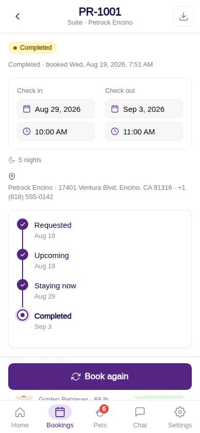
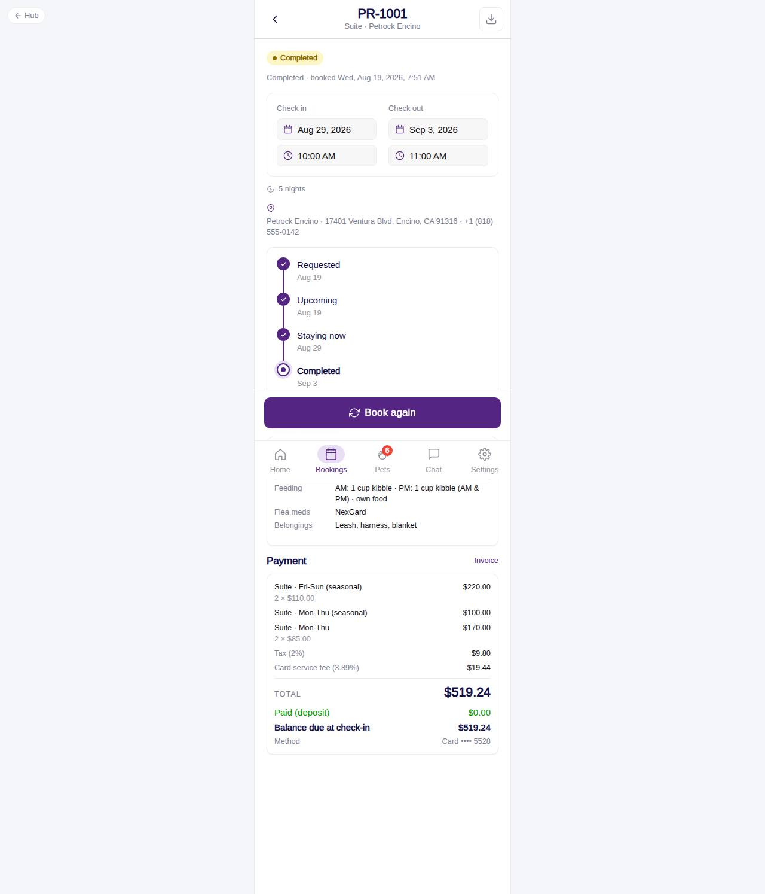

# C-39 · Reservation detail

## Purpose

One stay in full: status chip and timeline, dates and location, pets with vaccine state and the care notes, linked grooming, payment summary with balance, change requests, and the actions to request a change or cancel.

## Screenshots

| 390 | 1280 |
| --- | --- |
|  |  |

Dark: `../screenshots/C-39/390-dark.jpg`, `../screenshots/C-39/1280-dark.jpg`.

## Sections (layout order)

1. HotelBookingFrame (code, room · location, invoice IconButton)
2. StatusBadge + booked-on line
3. StayDatesCard read-only, location line
4. BookingStatusTimeline Card
5. Pets Section (Avatar, vaccine chip, care key-values)
6. Grooming Section (linked appointments)
7. Payment Section (HotelEstimateCard: lines, paid, balance, method)
8. Change requests Section
9. Sticky footer: Request a change / Cancel stay (or Book again)
10. Cancel Modal

## Data

| Table | Read / write | Notes |
| --- | --- | --- |
| `bookings` | read / write | status -> cancelled for unconfirmed stays |
| `booking_pets / booking_pet_care / pets` | read | pets and care notes |
| `vaccine_records / vaccine_types` | read | vaccine chips |
| `appointments / packages` | read / write | grooming; cancelled with the stay |
| `invoices / payments` | read | paid, balance, card last4 |
| `booking_change_requests` | read / write | list; cancel request |
| `room_types / locations / settings` | read | labels, free-cancellation hours |

## Rules

- R-X52 - customers request changes; unconfirmed stays cancel directly, confirmed stays need the desk
- R-I06 - the desk approves a confirmed cancellation with a manager PIN
- R-A05 / R-X51 - pending vaccines hint with link to upload proofs
- R-X50 - balance due at check-in
- R-I04 - customer wording

## Logic

- reachedAt for the timeline is derived from created_at / updated_at / check_in / check_out.
- Free-cancellation window from settings shown in the modal; the stay cannot be changed once checked in.

## Components

HotelBookingFrame, StatusBadge, Badge, StayDatesCard, BookingStatusTimeline, Section, Card, Avatar, HotelEstimateCard, Modal, IconButton, EmptyState, Button

## Real vs mock

Self-service cancellation marks payment_status refunded; the actual refund runs through the desk / PaymentProvider.refund later.

## Responsive check (D-016)

Checked at 360, 390, 768, 1280, 1920 on 2026-09-18 (Playwright against `vite preview`): no horizontal overflow, no console errors. The customer surface renders in the PhoneShell column (full-bleed under 600 px, centered 430 px column above); footer CTAs stack under 420 px.

## Changelog

- `docs/changelog/_pending/customer-hotel.md` (to be merged into the next numbered entry)
- 0019 - QA fixes: `StatusBadge customer` shows the customer vocabulary (R-I04); lines read through `quoteLinesOf()`.
