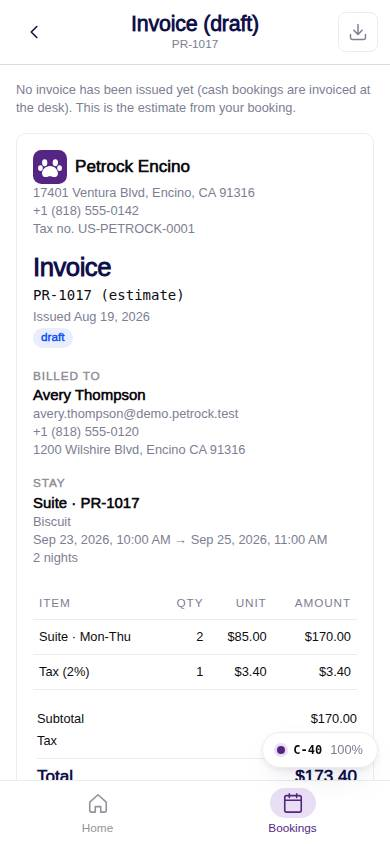
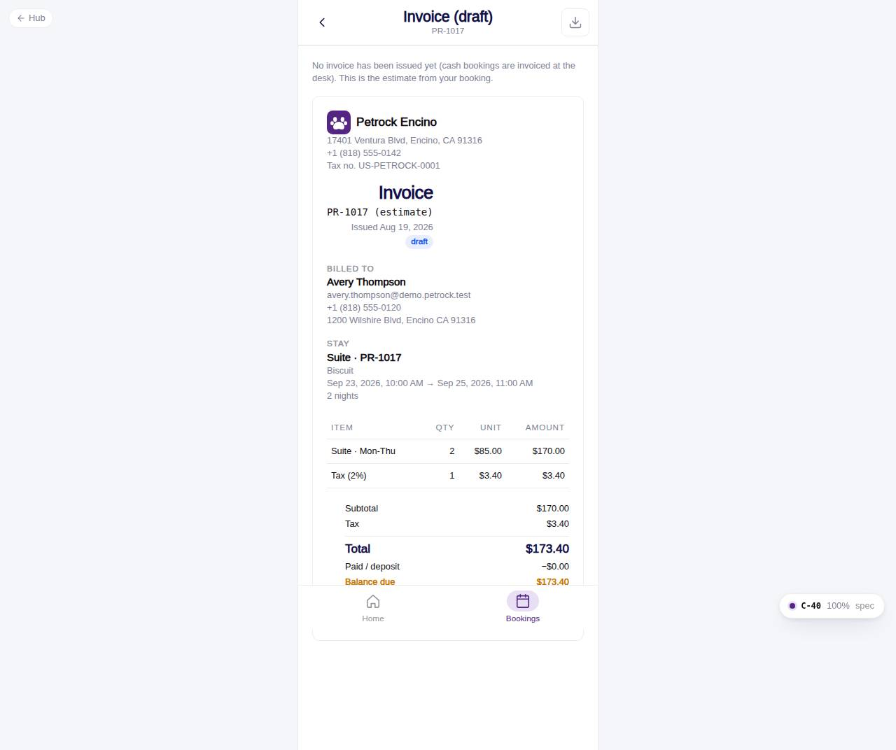

# C-40 · Reservation invoice

## Purpose

Printable invoice for a stay with business and customer blocks, the stay reference, line items, totals, deposit paid and balance due, payments and the footer. Falls back to the booking estimate when no invoice was issued yet.

## Screenshots

| 390 | 1280 |
| --- | --- |
|  |  |

Dark: not captured (not a key page).

## Sections (layout order)

1. HotelBookingFrame (number, code, print IconButton)
2. Draft notice (no invoice yet)
3. HotelInvoiceView

## Data

| Table | Read / write | Notes |
| --- | --- | --- |
| `invoices / payments` | read | issued invoice and its payments |
| `bookings / booking_pets / pets / customers / room_types / locations` | read | reference and parties |
| `taxes` | read | tax number |
| `settings` | read | invoice footer / show tax number |

## Rules

- R-H05 - tax number
- R-H09 - invoice numbering
- R-H10 - footer "Rock Out With Your Paws Out!"

## Logic

- window.print() with a print stylesheet that hides the shell.

## Components

HotelBookingFrame, HotelInvoiceView, IconButton, EmptyState, Button

## Real vs mock

PDF export is the browser print dialog for now.

## Responsive check (D-016)

Checked at 360, 390, 768, 1280, 1920 on 2026-09-18 (Playwright against `vite preview`): no horizontal overflow, no console errors. The customer surface renders in the PhoneShell column (full-bleed under 600 px, centered 430 px column above); footer CTAs stack under 420 px.

## Changelog

- `docs/changelog/_pending/customer-hotel.md` (to be merged into the next numbered entry)
