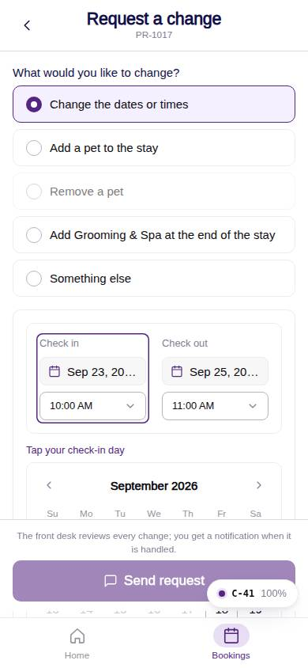
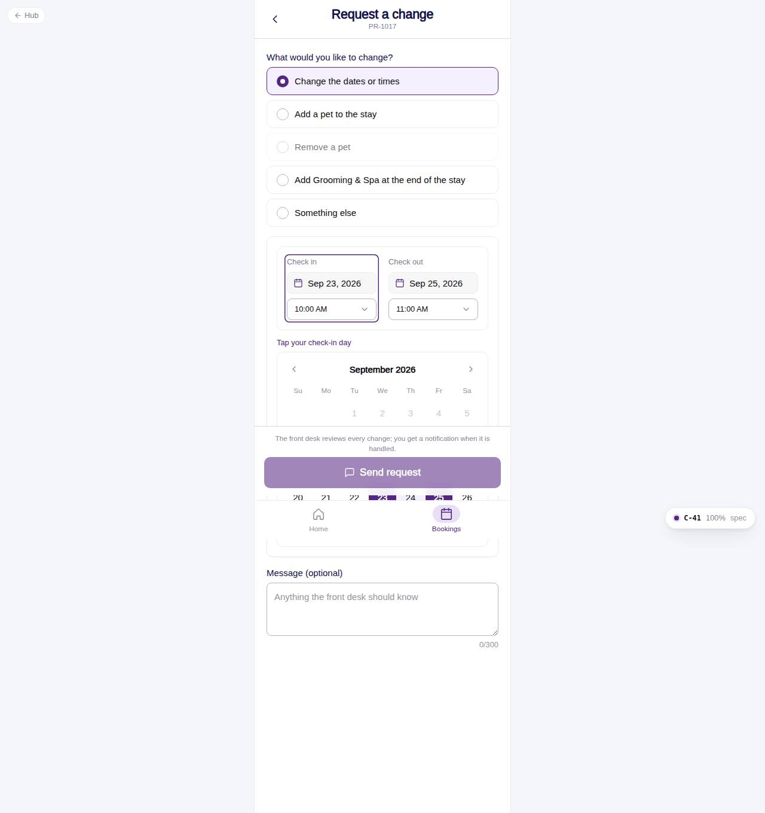

# C-41 · Request a change

## Purpose

Ask the front desk to modify a stay: new dates or times, add or remove a pet, add grooming, or something else, with a message. Creates a change request and notifies the desk at the booking location.

## Screenshots

| 390 | 1280 |
| --- | --- |
|  |  |

Dark: not captured (not a key page).

## Sections (layout order)

1. HotelBookingFrame (back to the stay)
2. Kind RadioGroup cards
3. Conditional: StayDatesCard (dates) / pet Checkboxes
4. Message Textarea (300 chars)
5. Sticky footer: Send request

## Data

| Table | Read / write | Notes |
| --- | --- | --- |
| `bookings / booking_pets / pets` | read | current stay and pets |
| `booking_change_requests` | write | open request |
| `notifications / users` | write / read | front_desk users of the location |
| `locations / settings` | read | hours for validation |

## Rules

- R-X32 - only requested / pending_vaccines / confirmed stays
- R-X34 - new dates validated like C-30

## Logic

- Add a pet lists pets not on the stay; remove lists pets on it (needs 2+).

## Components

HotelBookingFrame, RadioGroup, StayDatesCard, Checkbox, Textarea, Card, Toast, EmptyState, Button

## Real vs mock

The staff notification links to /desk/reservations/:id (frontdesk-reservations module path, to confirm at merge).

## Responsive check (D-016)

Checked at 360, 390, 768, 1280, 1920 on 2026-09-18 (Playwright against `vite preview`): no horizontal overflow, no console errors. The customer surface renders in the PhoneShell column (full-bleed under 600 px, centered 430 px column above); footer CTAs stack under 420 px.

## Changelog

- `docs/changelog/_pending/customer-hotel.md` (to be merged into the next numbered entry)
