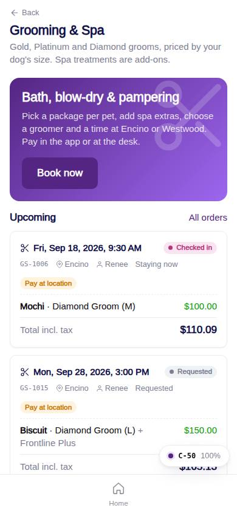
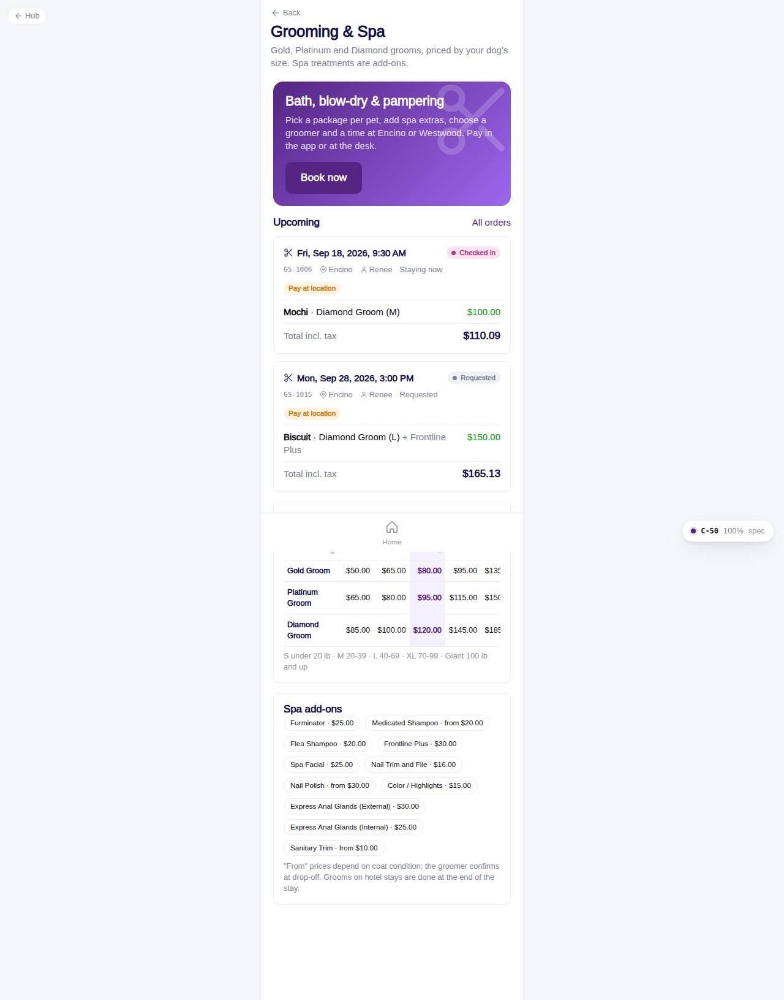

# C-50 · Grooming & Spa

## Purpose

Pet parents open the Grooming & Spa service here: see what it is, the live price menu (Gold / Platinum / Diamond by size S-Giant from the `packages` table), the spa add-ons, their upcoming orders, and start a booking. One service, one name (D-004 / D-011); Spa treatments are packages and add-ons of Grooming.

## Screenshots

| 390 | 1280 |
| --- | --- |
|  |  |

Dark: `../screenshots/C-50/390-dark.jpg`, `../screenshots/C-50/1280-dark.jpg`.

## Sections (layout order)

1. PageHeader with back to Home
2. Hero with Book now (resets the grooming draft, opens C-51; with no pets opens the Add-a-pet modal, R-A01)
3. Upcoming orders: up to three GroomingOrderCards (active statuses, tap opens C-55), link to all orders (C-56)
4. Packages: GroomingPriceMenu, packages x sizes, first pet's size highlighted
5. Spa add-ons as chips with price ("from" for starting prices)
6. EmptyState with a link to past orders when nothing is upcoming

## Data

| Table | Read / write | Notes |
| --- | --- | --- |
| `grooming_orders` | read | customer_id = current customer |
| `appointments` | read | per-pet lines of each order |
| `packages` | read | price menu |
| `addons` | read | chips |
| `pets` | read | size highlight, names |
| `locations` | read | short names on cards |
| `employees` | read | groomer names |
| `customers` | read | session user -> customer |

## Rules

- R-G01 / R-G02 / R-G04 / R-G06 - packages priced by size; every figure comes from `packages`
- R-G03 / R-G05 - inclusions copy shown in the price menu tooltip and on C-51 cards
- R-G11 - add-on prices as chips
- R-G22 - one Grooming & Spa service
- R-A01 - Book now without a pet opens the Add-a-pet modal
- R-A09 - note that grooms on hotel stays happen at the end of the stay

## Logic

- Customer = `customers.user_id == session user`; a super admin or staff viewing the customer app falls back to the demo customer.
- Upcoming = orders in requested / pending_vaccines / confirmed / checked_in that start later than three hours ago (first three, soonest first).
- Size highlight uses `pets.size` or `sizeFromWeightLbs(weight_lbs)`.

## Components

PageHeader, Button, Card, Chip, Icon, EmptyState, GroomingPriceMenu, GroomingOrderCard, Modal

## Real vs mock

Data is the MockProvider (localStorage, reseeded daily); every write above is real against it and appears in `/#/dev/tables`. Payments go through `MockPaymentProvider` (card ending 0002 declines); `StripePaymentProvider` will mount Stripe Elements in `ServicePayMethod`. Notifications are rows in `notifications` (no push yet). Vaccine proof is a mock URL; verification is a front-desk action. When Company-OS lands, `DataProvider` swaps and nothing on this page changes.

## Responsive check (D-016)

Checked at 360, 390, 768, 1280, 1920 on 2026-09-18 with Playwright (scratchpad runner): no horizontal scroll, no console errors. The customer surface renders in the PhoneShell column (max 430 px) at every width; pet cards scroll horizontally on phones and wrap on desktop; the flow footer stacks its buttons under 380 px.

## Changelog

- `docs/changelog/_pending/customer-grooming-daycare.md` (to be merged into the next numbered entry)
