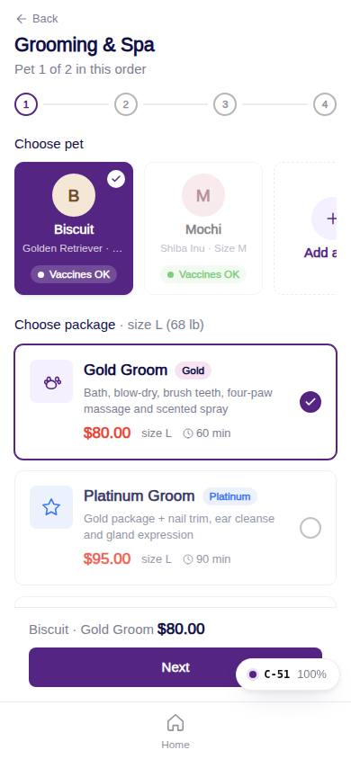
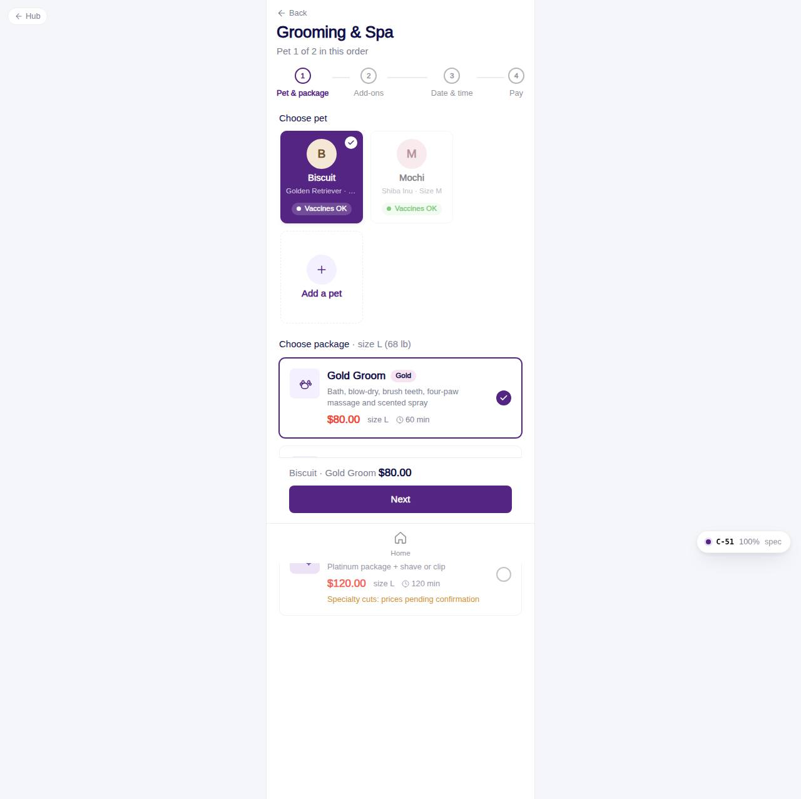

# C-51 · Choose pet & package

## Purpose

Step 1 of a Grooming & Spa order: pick the pet, then the package. Prices and chair minutes are the `packages` values for that pet's size tier, so the same Gold Groom shows $50 for Mochi (S) and $80 for Biscuit (L). Several pets can be added later (C-52 "Groom another pet"); this page then shows "Pet 2 of 2".

## Screenshots

| 390 | 1280 |
| --- | --- |
|  |  |

Dark: `../screenshots/C-51/390-dark.jpg`, `../screenshots/C-51/1280-dark.jpg`.

## Sections (layout order)

1. PageHeader + Stepper (1 of 4)
2. PetChoiceStrip: single select, breed, size, approval and vaccine badges; pets already in the order are disabled; dashed Add a pet card
3. Vaccine notice when the chosen pet has unverified required vaccines (R-A05 / R-A11)
4. Package list: one GroomingPackageCard per active package with price, minutes, inclusions, tier badge; Diamond carries the "prices pending confirmation" note (R-G06)
5. ServiceFlowFooter: running line "pet · package $x" and Next

## Data

| Table | Read / write | Notes |
| --- | --- | --- |
| `pets` | read | customer pets, size tier |
| `vaccine_records` | read | verified + not expired per required type |
| `vaccine_types` | read | required flag |
| `packages` | read | active, ordered |
| `customers` | read |  |

## Rules

- R-G01 / R-G02 / R-G04 / R-G06 - package price for the pet's size
- R-G03 / R-G05 - inclusions on the cards
- R-G14 - Figma placeholder prices are not used
- R-A05 / R-A11 - vaccine status shown; booking allowed but stays pending_vaccines
- R-A01 - empty state with Add a pet when the account has no pet

## Logic

- Draft `petrock.draft.grooming` = `{ items: [{ petId, packageId, addonIds }], current, locationId, date, time, groomerId, notes, source }` in localStorage; the page edits `items[current]`.
- `packagePrice(pkg, size)` and `packageMinutes(pkg, size)` from the pricing engine.
- Next is enabled when both pet and package are set.

## Components

PageHeader, Stepper, PetChoiceStrip, GroomingPackageCard, ServiceFlowFooter, EmptyState, Button

## Real vs mock

Data is the MockProvider (localStorage, reseeded daily); every write above is real against it and appears in `/#/dev/tables`. Payments go through `MockPaymentProvider` (card ending 0002 declines); `StripePaymentProvider` will mount Stripe Elements in `ServicePayMethod`. Notifications are rows in `notifications` (no push yet). Vaccine proof is a mock URL; verification is a front-desk action. When Company-OS lands, `DataProvider` swaps and nothing on this page changes.

## Responsive check (D-016)

Checked at 360, 390, 768, 1280, 1920 on 2026-09-18 with Playwright (scratchpad runner): no horizontal scroll, no console errors. The customer surface renders in the PhoneShell column (max 430 px) at every width; pet cards scroll horizontally on phones and wrap on desktop; the flow footer stacks its buttons under 380 px.

## Changelog

- `docs/changelog/_pending/customer-grooming-daycare.md` (to be merged into the next numbered entry)
