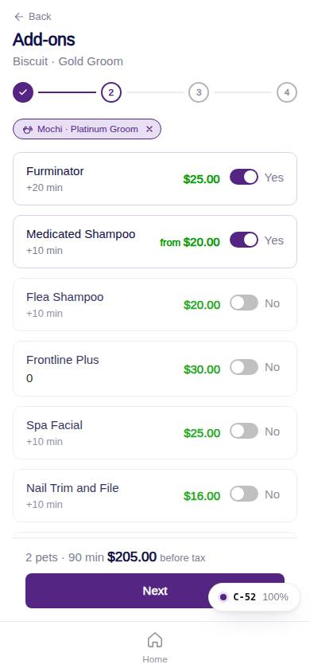
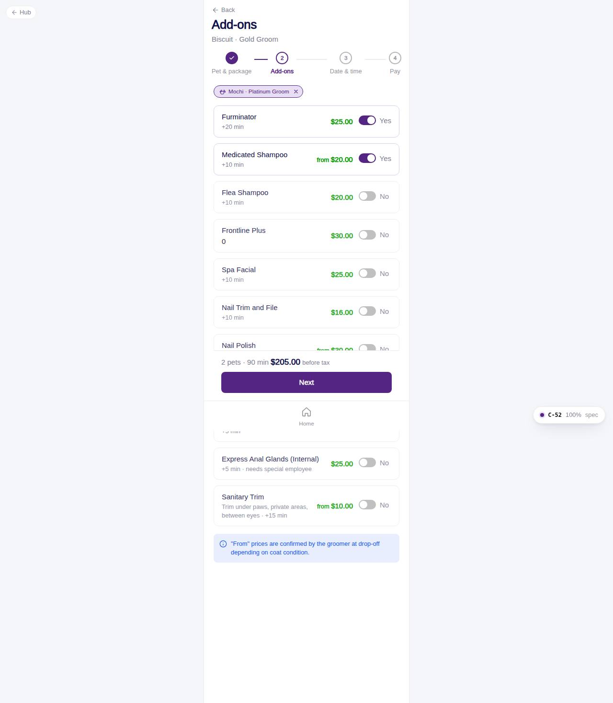

# C-52 · Add-ons

## Purpose

Step 2: switch spa add-ons on or off for the current pet. Each row shows the `addons` price ("from" when starting_at), the calendar minutes it adds for this pet's size and any employee restriction. The footer keeps the running subtotal for the whole order and offers "Groom another pet".

## Screenshots

| 390 | 1280 |
| --- | --- |
|  |  |

Dark: not captured for this step (key pages of the module: C-50, C-51, C-54, C-60, C-61, C-63).

## Sections (layout order)

1. PageHeader + Stepper (2 of 4), subtitle "pet · package"
2. Chips for the other pets already in the order (tap to edit, x to remove)
3. GroomingAddonRow per active add-on
4. Notice about "from" prices when one is selected
5. ServiceFlowFooter: Groom another pet (outlined, only while a pet is still unbooked) | Next; running subtotal before tax

## Data

| Table | Read / write | Notes |
| --- | --- | --- |
| `addons` | read | active add-ons |
| `packages` | read | names |
| `pets` | read | size for added minutes |
| `fees` | read | quote |
| `taxes` | read | quote |

## Rules

- R-G11 - add-on prices; "+" in the design = starting price
- R-G08 - Sanitary Trim starting price and description
- R-G12 - restricted add-on shows "needs special employee"
- R-G13 - added minutes by size (S/M vs L/XL/Giant)
- R-G16 - several pets per order via Groom another pet
- R-G14 - no placeholder prices

## Logic

- `addedMinutes = size in L/XL/Giant ? added_minutes_l : added_minutes_sm`.
- Running subtotal = `quoteOrder(items)` (one `quoteGrooming` per pet) before tax.
- Groom another pet appends an empty item, points `current` at it and returns to C-51.
- If the current item has no pet or package the page redirects to C-51.

## Components

PageHeader, Stepper, Chip, GroomingAddonRow, ServiceFlowFooter

## Real vs mock

Data is the MockProvider (localStorage, reseeded daily); every write above is real against it and appears in `/#/dev/tables`. Payments go through `MockPaymentProvider` (card ending 0002 declines); `StripePaymentProvider` will mount Stripe Elements in `ServicePayMethod`. Notifications are rows in `notifications` (no push yet). Vaccine proof is a mock URL; verification is a front-desk action. When Company-OS lands, `DataProvider` swaps and nothing on this page changes.

## Responsive check (D-016)

Checked at 360, 390, 768, 1280, 1920 on 2026-09-18 with Playwright (scratchpad runner): no horizontal scroll, no console errors. The customer surface renders in the PhoneShell column (max 430 px) at every width; pet cards scroll horizontally on phones and wrap on desktop; the flow footer stacks its buttons under 380 px.

## Changelog

- `docs/changelog/_pending/customer-grooming-daycare.md` (to be merged into the next numbered entry)
