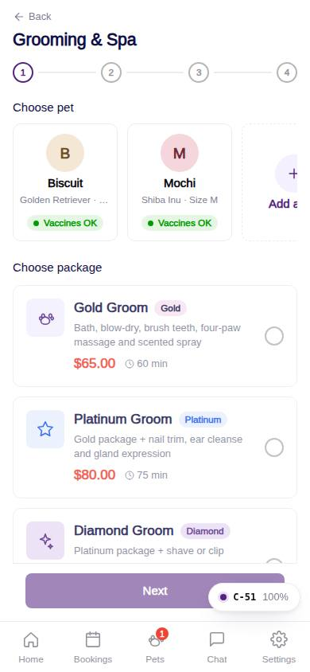
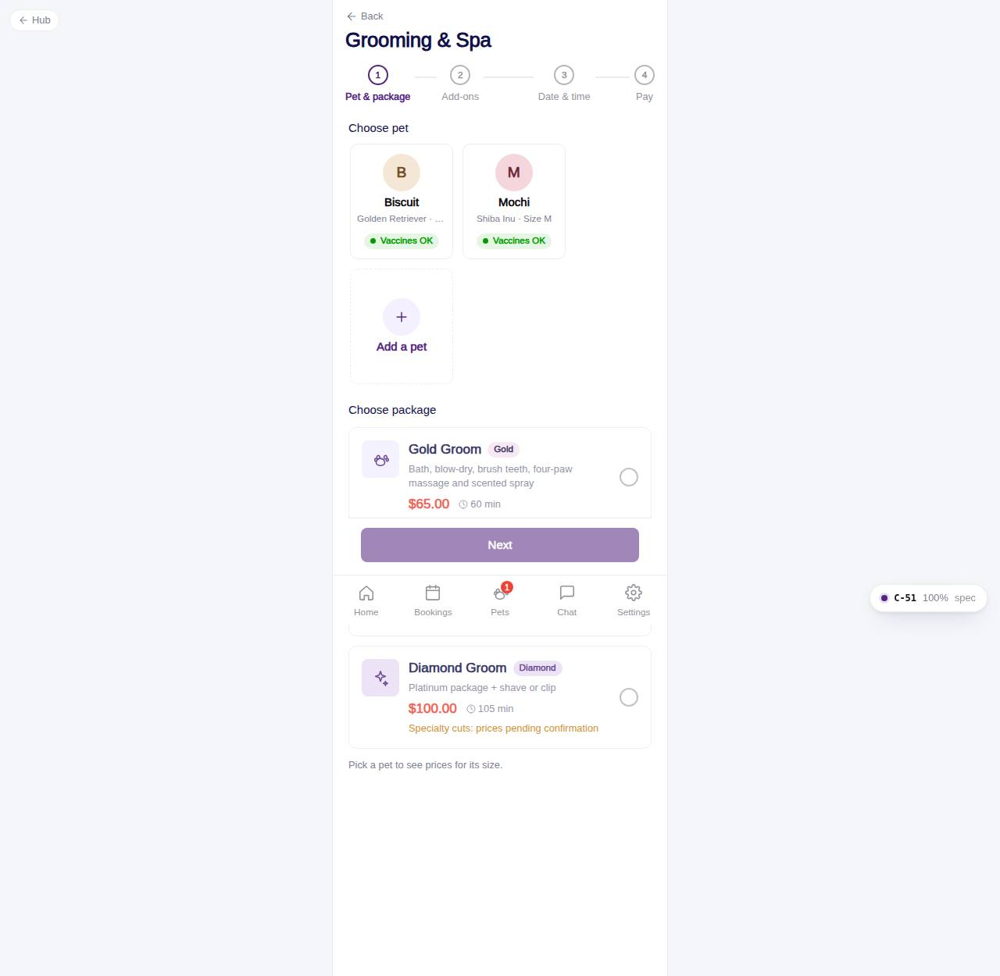

# C-53 · Choose date & time

## Purpose

Step 3: where and when. The customer picks Encino or Westwood, a date within 90 days, optionally a named groomer, and a start time. Start times are computed from the location's hours, the grooming capacity (two tables per location) and the appointments already booked, so the front desk never receives an impossible request.

## Screenshots

| 390 | 1280 |
| --- | --- |
|  |  |

Dark: not captured for this step (key pages of the module: C-50, C-51, C-54, C-60, C-61, C-63).

## Sections (layout order)

1. PageHeader + Stepper (3 of 4), subtitle with pets and total chair time
2. Location chips + address
3. DatePicker (today .. +90 days, closed days disabled)
4. Groomer select: Any available or a named active groomer at that location; hint when an add-on needs a special employee
5. Day card: opening hours and GroomingSlotPicker (Morning / Afternoon)
6. Notes for the groomer (100 characters)
7. ServiceFlowFooter: date · time and Next

## Data

| Table | Read / write | Notes |
| --- | --- | --- |
| `locations` | read | hours, address |
| `employees` | read | is_groomer, active, at location |
| `capacities` | read | kind grooming -> max_simultaneous |
| `appointments` | read | same location, for availability |
| `packages` | read | minutes |
| `addons` | read | added minutes |

## Rules

- R-X15 - slots inside location hours, order must end before closing, past times excluded
- R-G21 / R-E10 - capacity: booked appointments + pets in the order <= capacities.grooming for every 15-minute step
- R-G17 - minimum 60 minutes per pet
- R-G13 - add-on minutes extend the order
- R-K02 - business hours per location
- R-J02 - notes limited to 100 characters

## Logic

- `orderMinutes = longest per-pet chair time` (pets are groomed side by side up to capacity).
- `computeSlots()` in `src/modules/customer-grooming-daycare/slots.ts`: 30-minute steps from open to close - orderMinutes; unavailable slots stay visible with a reason ("Grooming tables are booked", "This groomer is busy", "Too soon").
- Changing location or groomer clears the chosen time.

## Components

PageHeader, Stepper, Chip, DatePicker, Select, Card, GroomingSlotPicker, Textarea, ServiceFlowFooter

## Real vs mock

Data is the MockProvider (localStorage, reseeded daily); every write above is real against it and appears in `/#/dev/tables`. Payments go through `MockPaymentProvider` (card ending 0002 declines); `StripePaymentProvider` will mount Stripe Elements in `ServicePayMethod`. Notifications are rows in `notifications` (no push yet). Vaccine proof is a mock URL; verification is a front-desk action. When Company-OS lands, `DataProvider` swaps and nothing on this page changes.

## Responsive check (D-016)

Checked at 360, 390, 768, 1280, 1920 on 2026-09-18 with Playwright (scratchpad runner): no horizontal scroll, no console errors. The customer surface renders in the PhoneShell column (max 430 px) at every width; pet cards scroll horizontally on phones and wrap on desktop; the flow footer stacks its buttons under 380 px.

## Changelog

- `docs/changelog/_pending/customer-grooming-daycare.md` (to be merged into the next numbered entry)
