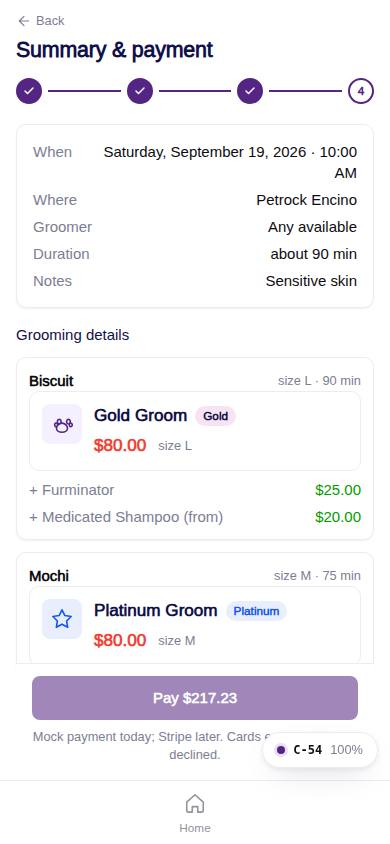

# C-54 · Summary & payment

## Purpose

Step 4: review the order (when, where, groomer, duration, per-pet package and add-ons), choose card or pay at location, see the engine totals (service tax and, for card, the card fee) and pay. On success the order, one appointment per pet, the invoice, the payment and a notification are written and the customer lands on C-55.

## Screenshots

| 390 | 1280 |
| --- | --- |
|  |  |

Dark: `../screenshots/C-54/390-dark.jpg`, `../screenshots/C-54/1280-dark.jpg`.

## Sections (layout order)

1. PageHeader + Stepper (4 of 4)
2. Card: when / where / groomer / duration / notes
3. Grooming details: one Card per pet with GroomingPackageCard (compact) and add-on lines
4. Vaccine notice when a pet is not verified
5. ServicePayMethod: card (mock fields; Stripe Elements mount when the provider needs it) or pay at location, with the card-fee note from `fees`
6. ServiceQuoteLines: per-pet service and add-on lines, tax, card fee, grand total, engine notes
7. ServiceFlowFooter: Pay $x / Book · pay $x at location

## Data

| Table | Read / write | Notes |
| --- | --- | --- |
| `grooming_orders` | write | one row per order |
| `appointments` | write | one row per pet (status requested / confirmed) |
| `invoices` | write | source_type appointment, source_id = order id |
| `payments` | write | card only, provider mock |
| `notifications` | write | booked / requested |
| `packages, addons, fees, taxes` | read | quote |
| `locations, employees, pets` | read | summary |

## Rules

- R-G15 - totals reconcile: package + add-ons + tax (+ fee); the Figma $500 / $64 / $565 are not reproduced
- R-H03 - card fee only when paying by card in the app
- R-H04 / R-H05 - service tax rate, prices exclusive
- R-A05 / R-A11 - pending_vaccines when any pet lacks a verified required vaccine
- R-G08 - "from" prices footnoted
- R-G16 - one payment for several pets

## Logic

- `quoteOrder()` sums one `quoteGrooming` per pet; tax and fee lines are merged into single lines.
- `PaymentProvider.createPaymentIntent` (MockPaymentProvider: last4 0002 declines).
- `statusFor(paid, vaccinesOk)`: !vaccinesOk -> pending_vaccines; paid -> confirmed; else requested. Appointments get `confirmed` or `requested` (their enum has no pending_vaccines; the order carries it).
- Clears the draft and navigates to `/app/grooming/orders/:id?new=1`.
- Below the quote lines: `cgd.groomingEstimateNote` ("Grooming rates are estimates; pets are assessed in person for the final rate.", petrockhotel.com/spa, D-187). The $12 sanitation fee is a `fees` row with `included: true` and is never added to the total.

## Components

PageHeader, Stepper, Card, GroomingPackageCard, ServicePayMethod, ServiceQuoteLines, ServiceFlowFooter, Toast

## Real vs mock

Data is the MockProvider (localStorage, reseeded daily); every write above is real against it and appears in `/#/dev/tables`. Payments go through `MockPaymentProvider` (card ending 0002 declines); `StripePaymentProvider` will mount Stripe Elements in `ServicePayMethod`. Notifications are rows in `notifications` (no push yet). Vaccine proof is a mock URL; verification is a front-desk action. When Company-OS lands, `DataProvider` swaps and nothing on this page changes.

## Responsive check (D-016)

Checked at 360, 390, 768, 1280, 1920 on 2026-09-18 with Playwright (scratchpad runner): no horizontal scroll, no console errors. The customer surface renders in the PhoneShell column (max 430 px) at every width; pet cards scroll horizontally on phones and wrap on desktop; the flow footer stacks its buttons under 380 px.

## Changelog

- `docs/changelog/_pending/customer-grooming-daycare.md` (to be merged into the next numbered entry)
