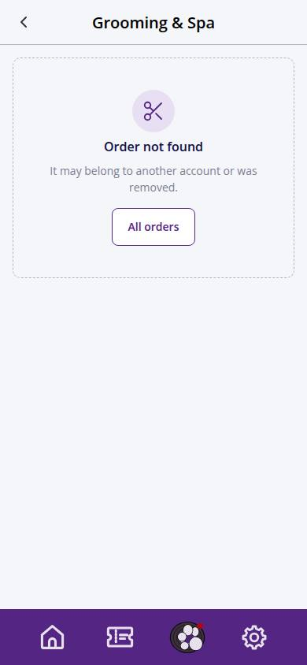
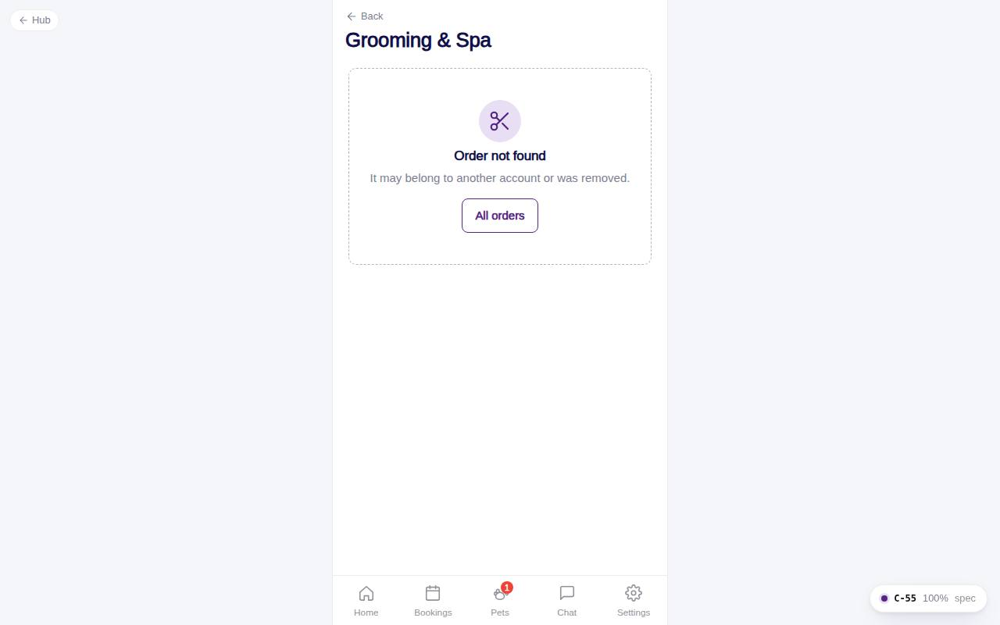

# C-55 · Order detail & confirmation

## Purpose

One Grooming & Spa order. Right after checkout it opens with a success block ("You're booked!" / "Request received"). It shows the status in the customer vocabulary (Pending verification, Upcoming, Completed), per-pet lines, location, groomer, chair time, payment and the invoice totals. Actions: Re-create (loads the same pets, packages and add-ons into a new draft and asks for a new time) and Cancel booking while the order is not yet confirmed; afterwards "Message the front desk".

## Screenshots

| 390 | 1280 |
| --- | --- |
|  |  |

Dark: not captured for this step (key pages of the module: C-50, C-51, C-54, C-60, C-61, C-63).

## Sections (layout order)

1. PageHeader
2. Success block when `?new=1`
3. GroomingOrderCard (tinted when new)
4. Pending-vaccines notice listing the missing vaccines per pet with a link to Pets
5. Details card: status, location, groomer, chair time, payment, invoice number, notes
6. Totals from the invoice lines (ServiceQuoteLines)
7. Actions row: Re-create | Cancel booking or Message the front desk
8. Cancel confirmation Modal

## Data

| Table | Read / write | Notes |
| --- | --- | --- |
| `grooming_orders` | read / write | status -> cancelled |
| `appointments` | read / write | status -> cancelled |
| `invoices` | read | totals |
| `notifications` | write | cancelled |
| `locations, employees, pets, packages, addons` | read | labels |

## Rules

- R-X14 - customer cancels only in requested / pending_vaccines; confirmed orders go through the desk (R-I06 PIN)
- R-A05 - pending_vaccines explained with the missing vaccines
- R-G16 - re-create a past order
- R-G15 - totals from the invoice, not typed
- R-D14 - invoice shows the balance (0 when paid)

## Logic

- `useRow('grooming_orders', id)` + appointments by `appointment_ids`.
- Re-create writes `petrock.draft.grooming` with `source: recreate` and opens C-53 (or C-51 if a package is missing).
- Cancel updates the order and its appointments and writes a notification; refunds are a desk action.

## Components

PageHeader, GroomingOrderCard, Card, ServiceQuoteLines, Button, Modal, EmptyState, Toast

## Real vs mock

Data is the MockProvider (localStorage, reseeded daily); every write above is real against it and appears in `/#/dev/tables`. Payments go through `MockPaymentProvider` (card ending 0002 declines); `StripePaymentProvider` will mount Stripe Elements in `ServicePayMethod`. Notifications are rows in `notifications` (no push yet). Vaccine proof is a mock URL; verification is a front-desk action. When Company-OS lands, `DataProvider` swaps and nothing on this page changes.

## Responsive check (D-016)

Checked at 360, 390, 768, 1280, 1920 on 2026-09-18 with Playwright (scratchpad runner): no horizontal scroll, no console errors. The customer surface renders in the PhoneShell column (max 430 px) at every width; pet cards scroll horizontally on phones and wrap on desktop; the flow footer stacks its buttons under 380 px.

## Changelog

- `docs/changelog/_pending/customer-grooming-daycare.md` (to be merged into the next numbered entry)
- 0019 - QA fixes: "Message the desk" links to `/app/inbox`.
