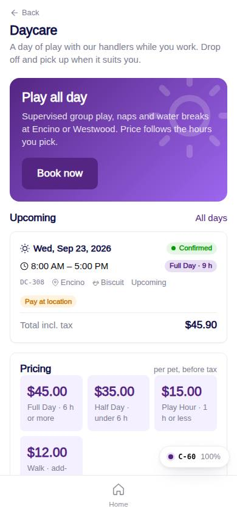
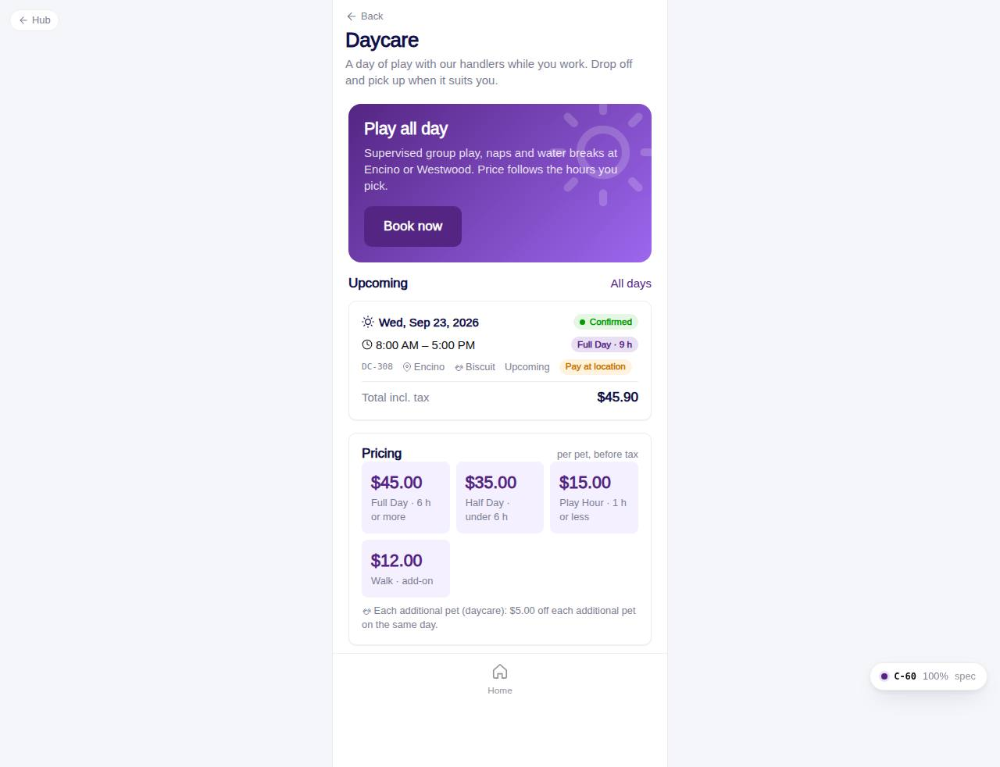

# C-60 · Daycare

## Purpose

Entry point of Daycare for pet parents: what it is, live pricing from `daycare_pricing` (Full Day with its hour threshold, Half Day, Play Hour, Walk) and the extra-pet discount from `discounts`, upcoming days and Book now. Replaces the Figma "Daycare Service Coming Soon" placeholder (R-A03, D-003).

## Screenshots

| 390 | 1280 |
| --- | --- |
|  |  |

Dark: `../screenshots/C-60/390-dark.jpg`, `../screenshots/C-60/1280-dark.jpg`.

## Sections (layout order)

1. PageHeader
2. Hero with Book now (resets the daycare draft with the home location; Add-a-pet modal when there is no pet)
3. Upcoming days: up to three DaycareDayCards, link to all days (C-65)
4. Pricing tiles with threshold copy and the extra-pet line
5. EmptyState with a link to past days

## Data

| Table | Read / write | Notes |
| --- | --- | --- |
| `daycare_bookings` | read | customer days |
| `daycare_pricing` | read | tiles |
| `discounts` | read | kind daycare_extra_pet |
| `pets` | read | names |
| `locations` | read | short names |
| `customers` | read |  |

## Rules

- R-F01 / R-F02 / R-F03 / R-F04 - prices and threshold from the table (6 h chosen until Justin confirms, D-019)
- R-F05 - extra-pet discount copy
- R-A03 - Daycare is bookable, not coming soon
- R-A01 - needs a pet

## Logic

- Threshold hours = `full_day.threshold_hours` (fallback half_day).
- Upcoming = date >= today and an active status.

## Components

PageHeader, Button, Card, Icon, EmptyState, DaycareDayCard, Modal

## Real vs mock

Data is the MockProvider (localStorage, reseeded daily); every write above is real against it and appears in `/#/dev/tables`. Payments go through `MockPaymentProvider` (card ending 0002 declines); `StripePaymentProvider` will mount Stripe Elements in `ServicePayMethod`. Notifications are rows in `notifications` (no push yet). Vaccine proof is a mock URL; verification is a front-desk action. When Company-OS lands, `DataProvider` swaps and nothing on this page changes.

## Responsive check (D-016)

Checked at 360, 390, 768, 1280, 1920 on 2026-09-18 with Playwright (scratchpad runner): no horizontal scroll, no console errors. The customer surface renders in the PhoneShell column (max 430 px) at every width; pet cards scroll horizontally on phones and wrap on desktop; the flow footer stacks its buttons under 380 px.

## Changelog

- `docs/changelog/_pending/customer-grooming-daycare.md` (to be merged into the next numbered entry)
