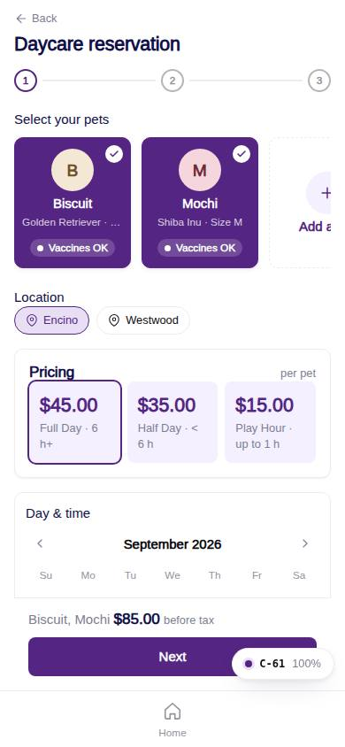
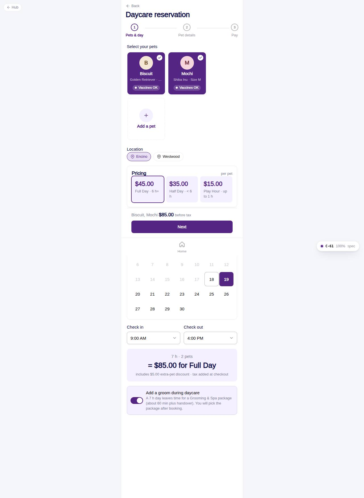

# C-61 · Daycare reservation

## Purpose

Step 1 of a daycare booking: select one or more pets, the location and the day, set drop-off and pick-up times, and watch the price update live: Half Day under the threshold, Full Day at or above it, Play Hour for one hour or less, minus the extra-pet discount. The Figma "$45 for Half Day" bug is fixed by computing from the times (R-F06). The day length also decides whether grooming can be added (R-X02 / R-X07).

## Screenshots

| 390 | 1280 |
| --- | --- |
|  |  |

Dark: `../screenshots/C-61/390-dark.jpg`, `../screenshots/C-61/1280-dark.jpg`.

## Sections (layout order)

1. PageHeader + Stepper (1 of 3)
2. PetChoiceStrip (multi select) with approval and vaccine badges
3. Vaccine notice
4. Location chips
5. Pricing tiles; the tile that applies is outlined
6. DatePicker (closed days disabled, 90-day window)
7. Check in / Check out TimePickers within opening hours
8. Computed price block "= $x for Full Day"
9. Add-grooming toggle (day long enough) or the "no time for grooming" notice
10. ServiceFlowFooter: pets and price, Next

## Data

| Table | Read / write | Notes |
| --- | --- | --- |
| `pets, vaccine_records, vaccine_types` | read | choice + badges |
| `locations` | read | hours |
| `daycare_pricing, discounts, fees, taxes` | read | quote |
| `packages` | read | shortest groom for the fit rule |
| `settings` | read | key daycare -> grooming_buffer_min (default 60) |

## Rules

- R-F01 / R-F02 / R-F03 - item by hours
- R-F05 - extra-pet discount
- R-F06 - price computed from the times
- R-X06 - check-out at least 1 h after check-in and inside hours; closed days disabled
- R-X02 / R-X07 - grooming fits only when hours*60 >= shortest package + buffer
- R-A05 / R-A11 - vaccine status shown
- R-K02 - hours

## Logic

- `hours = check_out - check_in`; `quoteDaycare({ hours, pets, pricing, discounts })`.
- Times are clamped to the day window when the date or location changes.
- `groomingFitMinutes(sizes, packages, buffer)` = min package minutes for the chosen pets' sizes + buffer.

## Components

PageHeader, Stepper, PetChoiceStrip, Chip, Card, DatePicker, TimePicker, Toggle, ServiceFlowFooter

## Real vs mock

Data is the MockProvider (localStorage, reseeded daily); every write above is real against it and appears in `/#/dev/tables`. Payments go through `MockPaymentProvider` (card ending 0002 declines); `StripePaymentProvider` will mount Stripe Elements in `ServicePayMethod`. Notifications are rows in `notifications` (no push yet). Vaccine proof is a mock URL; verification is a front-desk action. When Company-OS lands, `DataProvider` swaps and nothing on this page changes.

## Responsive check (D-016)

Checked at 360, 390, 768, 1280, 1920 on 2026-09-18 with Playwright (scratchpad runner): no horizontal scroll, no console errors. The customer surface renders in the PhoneShell column (max 430 px) at every width; pet cards scroll horizontally on phones and wrap on desktop; the flow footer stacks its buttons under 380 px.

## Changelog

- `docs/changelog/_pending/customer-grooming-daycare.md` (to be merged into the next numbered entry)
