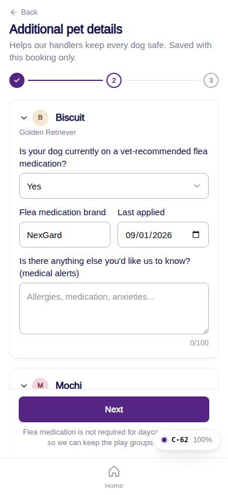
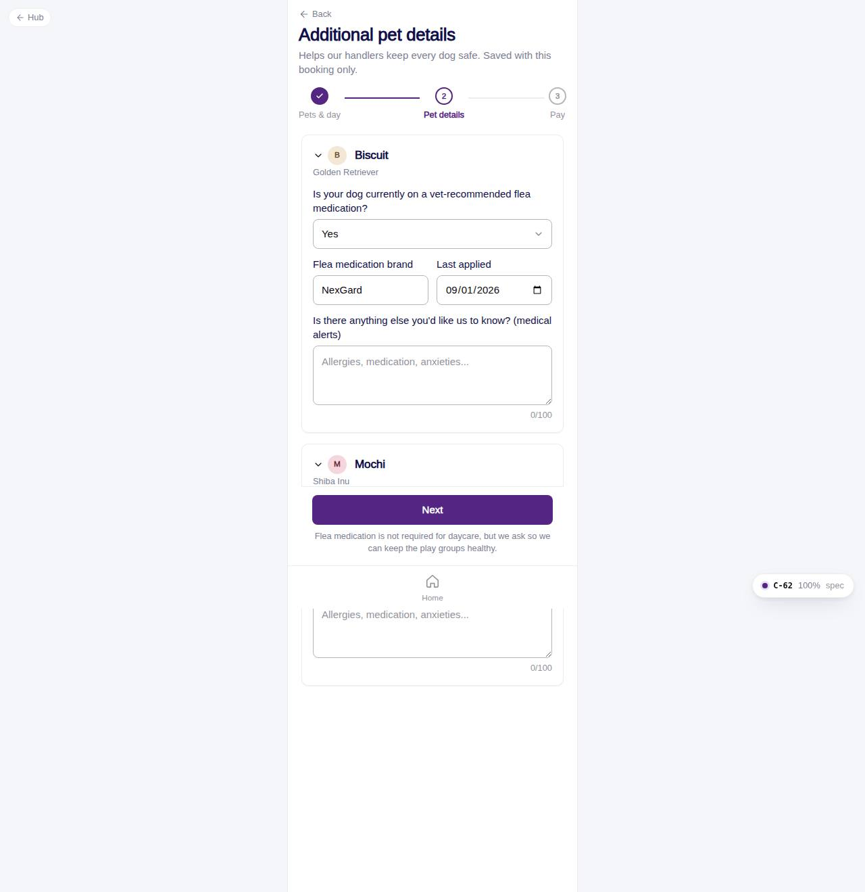

# C-62 · Additional pet details

## Purpose

Step 2: for each selected pet, whether it is on a vet-recommended flea medication (brand and last application when yes) and anything else the handlers should know. Answers are stored per booking in `daycare_booking_pets`, so they can differ from day to day.

## Screenshots

| 390 | 1280 |
| --- | --- |
|  |  |

Dark: not captured for this step (key pages of the module: C-50, C-51, C-54, C-60, C-61, C-63).

## Sections (layout order)

1. PageHeader + Stepper (2 of 3)
2. One Card + collapsible Section per pet: flea medication select, brand + date row, medical alerts textarea (100 chars), "on file" notice from the pet profile
3. ServiceFlowFooter: Next

## Data

| Table | Read / write | Notes |
| --- | --- | --- |
| `pets` | read | names, on-file conditions |
| `daycare_booking_pets` | write (at checkout) | answers |

## Rules

- R-A10 - medical questionnaire per pet
- R-J02 - 100-character notes

## Logic

- Answers live in `draft.details[petId]`; brand and date only when Yes.
- Redirects to C-61 when no pets or date are set.

## Components

PageHeader, Stepper, Card, Section, Avatar, Select, Input, Textarea, ServiceFlowFooter

## Real vs mock

Data is the MockProvider (localStorage, reseeded daily); every write above is real against it and appears in `/#/dev/tables`. Payments go through `MockPaymentProvider` (card ending 0002 declines); `StripePaymentProvider` will mount Stripe Elements in `ServicePayMethod`. Notifications are rows in `notifications` (no push yet). Vaccine proof is a mock URL; verification is a front-desk action. When Company-OS lands, `DataProvider` swaps and nothing on this page changes.

## Responsive check (D-016)

Checked at 360, 390, 768, 1280, 1920 on 2026-09-18 with Playwright (scratchpad runner): no horizontal scroll, no console errors. The customer surface renders in the PhoneShell column (max 430 px) at every width; pet cards scroll horizontally on phones and wrap on desktop; the flow footer stacks its buttons under 380 px.

## Changelog

- `docs/changelog/_pending/customer-grooming-daycare.md` (to be merged into the next numbered entry)
