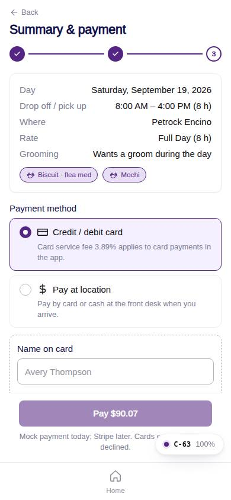
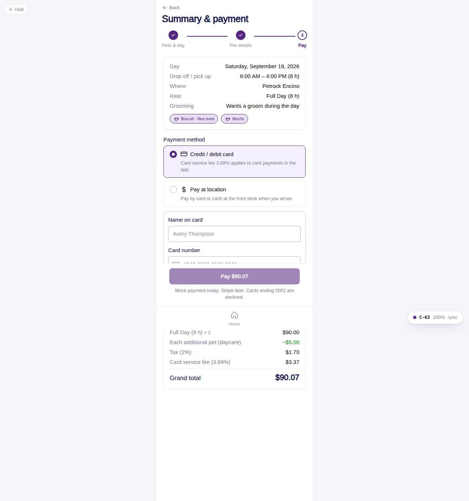

# C-63 · Daycare checkout

## Purpose

Step 3: summary of the day (date, times, location, rate, pets with their questionnaire flags), card or pay at location, engine totals with tax and card fee, and Pay. Writes the daycare day, its per-pet details, the invoice, the payment and a notification, then opens C-64.

## Screenshots

| 390 | 1280 |
| --- | --- |
|  |  |

Dark: `../screenshots/C-63/390-dark.jpg`, `../screenshots/C-63/1280-dark.jpg`.

## Sections (layout order)

1. PageHeader + Stepper (3 of 3)
2. Summary card + pet chips
3. Vaccine notice
4. ServicePayMethod
5. ServiceQuoteLines
6. ServiceFlowFooter: Pay $x / Book · pay $x at location

## Data

| Table | Read / write | Notes |
| --- | --- | --- |
| `daycare_bookings` | write |  |
| `daycare_booking_pets` | write | one per pet |
| `invoices` | write | source_type daycare |
| `payments` | write | card only |
| `notifications` | write |  |
| `daycare_pricing, discounts, fees, taxes` | read | quote |
| `locations, pets` | read |  |

## Rules

- R-F01 / R-F02 / R-F05 / R-F06 - quote
- R-H03 / R-H04 - card fee and tax
- R-A05 - status

## Logic

- `quoteDaycare(..., payWithCard)`; `statusFor(paid, vaccinesOk)`.
- Clears the draft and navigates to `/app/daycare/bookings/:id?new=1`.

## Components

PageHeader, Stepper, Card, Chip, ServicePayMethod, ServiceQuoteLines, ServiceFlowFooter, Toast

## Real vs mock

Data is the MockProvider (localStorage, reseeded daily); every write above is real against it and appears in `/#/dev/tables`. Payments go through `MockPaymentProvider` (card ending 0002 declines); `StripePaymentProvider` will mount Stripe Elements in `ServicePayMethod`. Notifications are rows in `notifications` (no push yet). Vaccine proof is a mock URL; verification is a front-desk action. When Company-OS lands, `DataProvider` swaps and nothing on this page changes.

## Responsive check (D-016)

Checked at 360, 390, 768, 1280, 1920 on 2026-09-18 with Playwright (scratchpad runner): no horizontal scroll, no console errors. The customer surface renders in the PhoneShell column (max 430 px) at every width; pet cards scroll horizontally on phones and wrap on desktop; the flow footer stacks its buttons under 380 px.

## Changelog

- `docs/changelog/_pending/customer-grooming-daycare.md` (to be merged into the next numbered entry)
