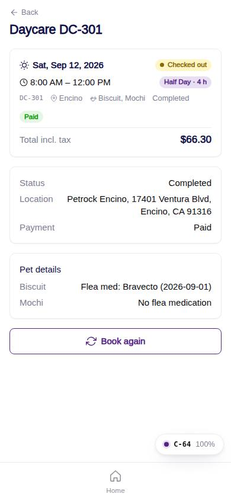
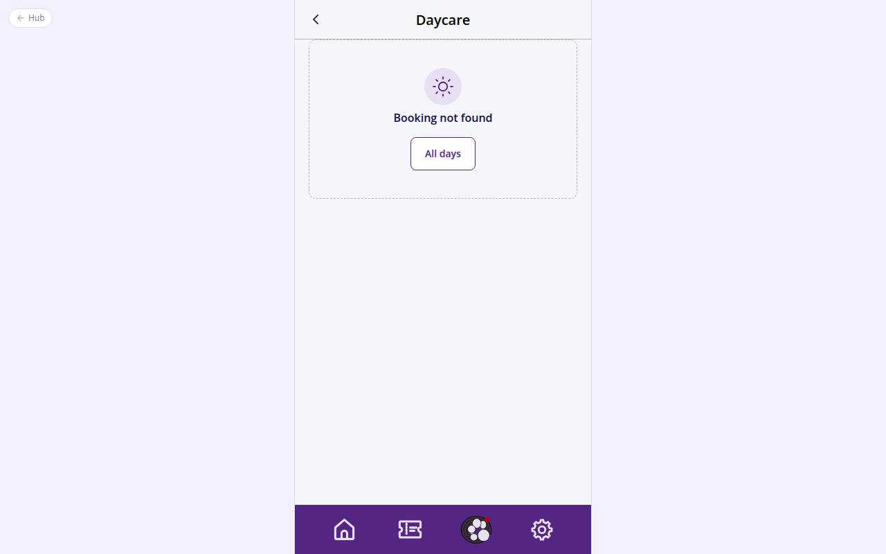

# C-64 · Daycare day detail

## Purpose

One daycare day: confirmation right after checkout, status, pets and their questionnaire answers, payment and invoice totals. Actions: Book again (prefills a new draft), Cancel booking while not confirmed (R-X14), Message the front desk afterwards, and "Book grooming" when the day is long enough for a groom (R-X17).

## Screenshots

| 390 | 1280 |
| --- | --- |
|  |  |

Dark: not captured for this step (key pages of the module: C-50, C-51, C-54, C-60, C-61, C-63).

## Sections (layout order)

1. PageHeader
2. Success block when `?new=1`
3. DaycareDayCard
4. Pending-vaccines notice
5. Add-grooming card (tinted) when the day fits a groom
6. Details card: status, location, payment, invoice, notes
7. Pet details card from `daycare_booking_pets`
8. Totals (ServiceQuoteLines from the invoice)
9. Actions: Book again | Cancel / Message the front desk
10. Cancel Modal

## Data

| Table | Read / write | Notes |
| --- | --- | --- |
| `daycare_bookings` | read / write | status -> cancelled |
| `daycare_booking_pets` | read |  |
| `invoices` | read | source daycare |
| `notifications` | write |  |
| `locations, pets, daycare_pricing, packages` | read |  |

## Rules

- R-X14 - cancel before confirmation only
- R-X17 / R-X02 - grooming offered when hours*60 >= shortest package + 60
- R-A05 - pending vaccines
- R-F05 - discount line in totals

## Logic

- Book again -> daycare draft with the same pets, times, location and answers -> C-61.
- Book grooming -> grooming draft with the same pets, date and location -> C-51.

## Components

PageHeader, DaycareDayCard, Card, ServiceQuoteLines, Button, Modal, EmptyState, Toast

## Real vs mock

Data is the MockProvider (localStorage, reseeded daily); every write above is real against it and appears in `/#/dev/tables`. Payments go through `MockPaymentProvider` (card ending 0002 declines); `StripePaymentProvider` will mount Stripe Elements in `ServicePayMethod`. Notifications are rows in `notifications` (no push yet). Vaccine proof is a mock URL; verification is a front-desk action. When Company-OS lands, `DataProvider` swaps and nothing on this page changes.

## Responsive check (D-016)

Checked at 360, 390, 768, 1280, 1920 on 2026-09-18 with Playwright (scratchpad runner): no horizontal scroll, no console errors. The customer surface renders in the PhoneShell column (max 430 px) at every width; pet cards scroll horizontally on phones and wrap on desktop; the flow footer stacks its buttons under 380 px.

## Changelog

- `docs/changelog/_pending/customer-grooming-daycare.md` (to be merged into the next numbered entry)
- 0019 - QA fixes: "Message the desk" links to `/app/inbox`.
