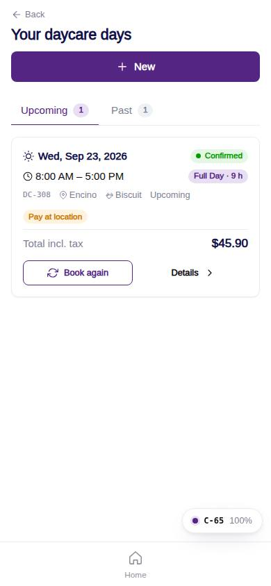
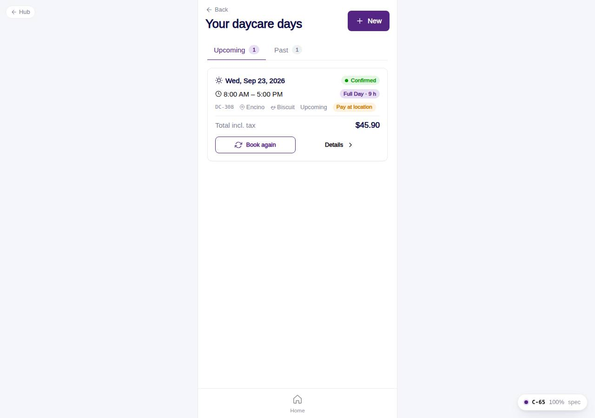

# C-65 · Your daycare days

## Purpose

History of daycare days in Upcoming and Past tabs; each card offers Book again and Details; New starts a fresh booking.

## Screenshots

| 390 | 1280 |
| --- | --- |
|  |  |

Dark: not captured for this step (key pages of the module: C-50, C-51, C-54, C-60, C-61, C-63).

## Sections (layout order)

1. PageHeader with New
2. Tabs Upcoming / Past
3. DaycareDayCard list
4. EmptyState

## Data

| Table | Read / write | Notes |
| --- | --- | --- |
| `daycare_bookings` | read |  |
| `daycare_pricing` | read | item labels |
| `pets, locations` | read |  |

## Rules

- R-I01 - status colours
- R-F01 / R-F02 - item labels from the table

## Logic

- Upcoming = date >= today with an active status, ascending; Past = the rest, newest first.

## Components

PageHeader, Tabs, DaycareDayCard, Button, EmptyState

## Real vs mock

Data is the MockProvider (localStorage, reseeded daily); every write above is real against it and appears in `/#/dev/tables`. Payments go through `MockPaymentProvider` (card ending 0002 declines); `StripePaymentProvider` will mount Stripe Elements in `ServicePayMethod`. Notifications are rows in `notifications` (no push yet). Vaccine proof is a mock URL; verification is a front-desk action. When Company-OS lands, `DataProvider` swaps and nothing on this page changes.

## Responsive check (D-016)

Checked at 360, 390, 768, 1280, 1920 on 2026-09-18 with Playwright (scratchpad runner): no horizontal scroll, no console errors. The customer surface renders in the PhoneShell column (max 430 px) at every width; pet cards scroll horizontally on phones and wrap on desktop; the flow footer stacks its buttons under 380 px.

## Changelog

- `docs/changelog/_pending/customer-grooming-daycare.md` (to be merged into the next numbered entry)
