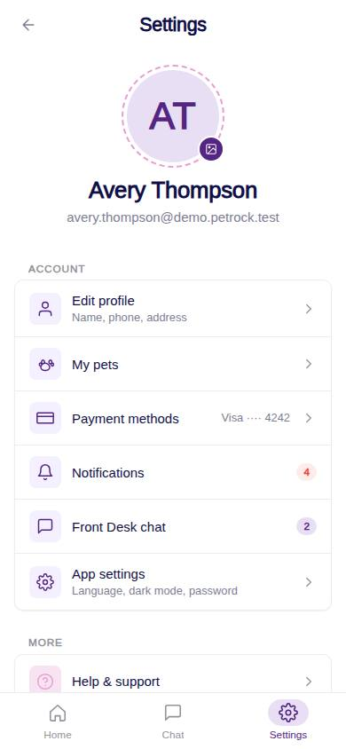
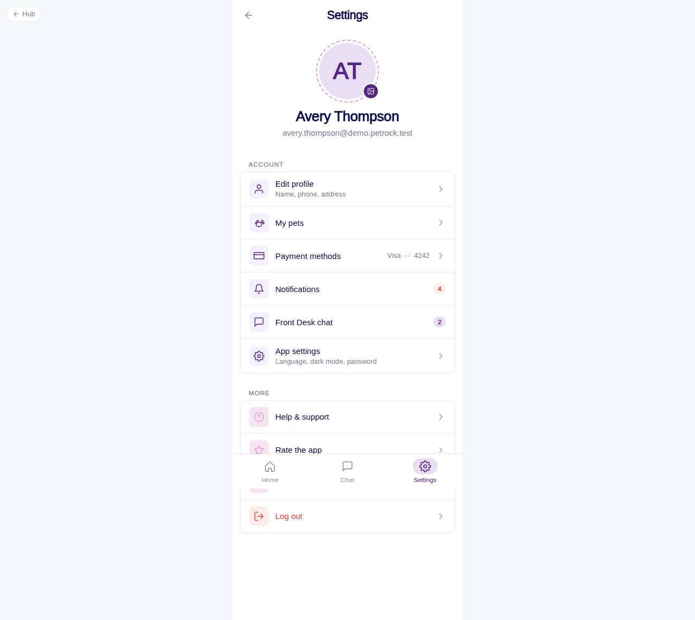

# C-70 · Profile hub

## Purpose

The **Settings** tab of the customer app. Pet parents see their photo, name and email and reach everything about their account: edit profile, pets, payment methods, notifications, Front Desk chat, app settings, help, rating, legal and log out. Staff previewing the customer app see the demo customer with a "Previewing as" chip.

## Screenshots

| 390 | 1280 |
| --- | --- |
|  |  |

Captured as the demo customer (Avery Thompson). Dark: `../screenshots/C-70/390-dark.jpg`.

## Sections (layout order)

1. CustomerScreenHeader - back to Home, title Settings
2. AccountProfileHero - avatar in a dashed accent ring, camera badge picks a photo (mock upload to `users.avatar_url`, 1.5 MB cap), name, email
3. Preview chip - only when the signed-in user is not a customer (super admin / staff previewing)
4. Account - Edit profile, My pets (link to the pets module), Payment methods (default card as value), Notifications (unread badge), Front Desk chat (unread badge), App settings
5. More - Help & support, Rate the app, About & legal, Log out (signOut -> /auth/sign-in)

## Data

| Table | Read / write | Notes |
| --- | --- | --- |
| `customers` | read | account behind the user (`useCustomerAccount`) |
| `users` | read / write | name, email, avatar_url |
| `notifications` | read | unread count badge |
| `conversations` | read | unread_customer sum |
| `payment_methods` | read | default card label |

## Rules

- `R-M06` - the menu is the Figma list minus Add Pets / Invite Friend (open question 62); Address folded into Edit profile
- `R-M04` - dark mode lives one level down in App settings

## Logic

- `useCustomerAccount()` finds the `customers` row whose `user_id` is the session user; when none exists (staff previewing) it falls back to the demo customer and flags `previewing`.
- Badges are live counts from `useTable` (mock provider change events).

## Components

CustomerScreenHeader, AccountProfileHero, AccountMenuRow, Card, Badge, Chip, Toast

## Real vs mock

All reads and writes go through the mock DataProvider (localStorage). Photo upload is a data URL; Company-OS storage replaces it. My pets links to `/app/pets` owned by the customer-home-pets module.

## Responsive check (D-016)

Checked 2026-09-18 with Playwright (`scripts/screenshots-customer-settings-chat.mjs`) at 360, 390, 768, 1280 and 1920: no console errors, no horizontal overflow. The customer surface renders in a centered 430 px column from 600 px up (PhoneShell), so tablet and desktop widths show the phone layout with side gutters.

## Changelog

- `docs/changelog/_pending/customer-settings-chat.md` (to be merged into the next numbered entry)
