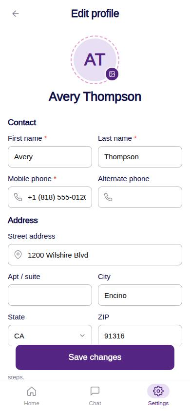
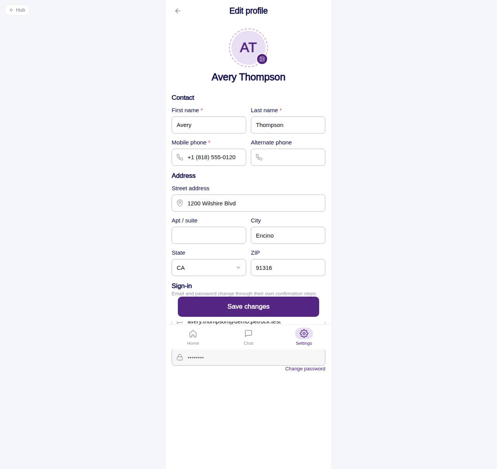

# C-71 · Edit profile

## Purpose

Update contact details and address. Email and password are not edited inline: email opens a confirmation modal, password goes to its own screen (R-M01).

## Screenshots

| 390 | 1280 |
| --- | --- |
|  |  |

Captured as the demo customer (Avery Thompson).

## Sections (layout order)

1. CustomerScreenHeader - back to the hub
2. AccountProfileHero - smaller avatar with photo picker
3. Contact - first name, last name, mobile (required), alternate phone
4. Address - street, apt / suite, city, state (Select), ZIP
5. Sign-in - email read-only + Change email link (modal), password disabled + Change password link (C-84)
6. Sticky Save changes

## Data

| Table | Read / write | Notes |
| --- | --- | --- |
| `customers` | read / write | all contact and address fields |
| `users` | write | name and phone mirrored |
| `audit_log` | write | `email.change` when the email is confirmed |

## Rules

- `R-M01` - separate flows for email and password; password shown masked and disabled

## Logic

- Validation: first / last / mobile required; phone regex; ZIP 5 digits (+4 optional).
- Change email modal asks for the new address and the current password (mock check, min 4 chars), updates customers + users and writes audit_log.

## Components

CustomerScreenHeader, AccountProfileHero, Section, Input, Select, Button, Modal, Toast

## Real vs mock

Password confirmation is mock. With Company-OS the email change becomes a verification-link flow.

## Responsive check (D-016)

Checked 2026-09-18 with Playwright (`scripts/screenshots-customer-settings-chat.mjs`) at 360, 390, 768, 1280 and 1920: no console errors, no horizontal overflow. The customer surface renders in a centered 430 px column from 600 px up (PhoneShell), so tablet and desktop widths show the phone layout with side gutters.

## Changelog

- `docs/changelog/_pending/customer-settings-chat.md` (to be merged into the next numbered entry)
