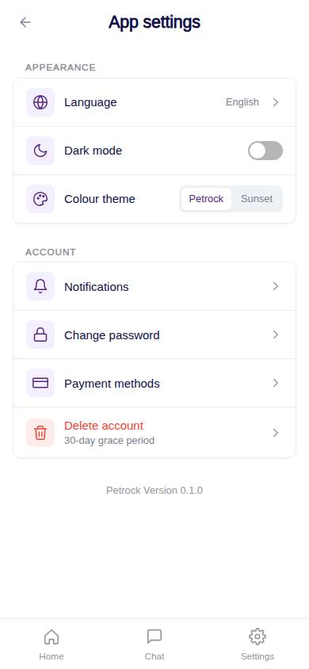
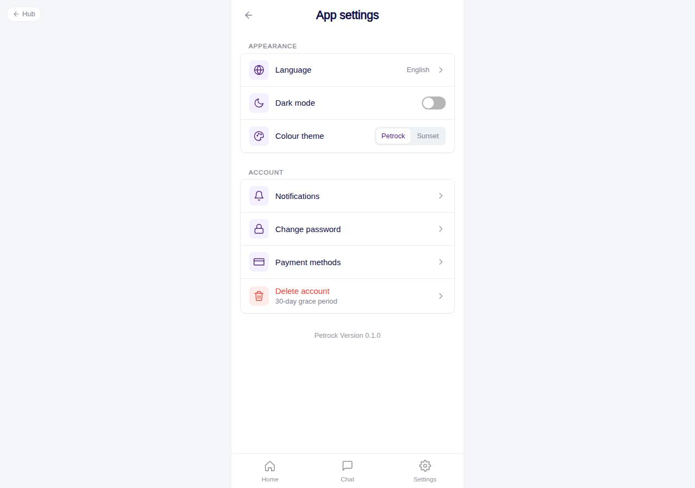

# C-72 · App settings

## Purpose

Device and account settings: language, dark mode, colour theme (proves theming), notification preferences, change password, payment methods and delete account.

## Screenshots

| 390 | 1280 |
| --- | --- |
|  |  |

Captured as the demo customer (Avery Thompson). Dark: `../screenshots/C-72/390-dark.jpg`. Spanish: `../screenshots/C-72/390-es.jpg`.

## Sections (layout order)

1. CustomerScreenHeader
2. Appearance - Language (value = current language, opens C-73), Dark mode Toggle, Colour theme SegmentedControl (Petrock / Sunset)
3. Account - Notifications (C-75), Change password (C-84), Payment methods (C-74), Delete account (danger, C-76)
4. Version line

## Data

| Table | Read / write | Notes |
| --- | --- | --- |
| `users` | read | preferred_language shown via i18n |

## Rules

- `R-M04` - dark mode toggle (ThemeProvider, persisted in `petrock.theme`)
- `R-M05` - delete account reachable from settings
- `R-M03` - language has its own screen with explicit Save

## Logic

- Theme and brand write through `useTheme()`; the whole app re-themes instantly.

## Components

CustomerScreenHeader, AccountMenuRow, Card, Toggle, SegmentedControl

## Real vs mock

Everything real (device settings). Version from package.json.

## Responsive check (D-016)

Checked 2026-09-18 with Playwright (`scripts/screenshots-customer-settings-chat.mjs`) at 360, 390, 768, 1280 and 1920: no console errors, no horizontal overflow. The customer surface renders in a centered 430 px column from 600 px up (PhoneShell), so tablet and desktop widths show the phone layout with side gutters.

## Changelog

- `docs/changelog/_pending/customer-settings-chat.md` (to be merged into the next numbered entry)
