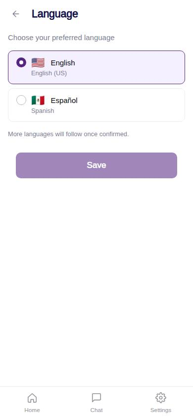
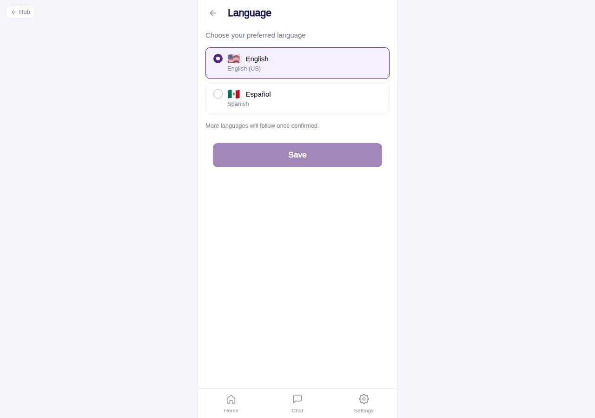

# C-73 · Language

## Purpose

Choose the app language and save it on the device and on the account. Two languages for now (English, Español) instead of the five drawn in Figma (decision pending Justin).

## Screenshots

| 390 | 1280 |
| --- | --- |
|  |  |

Captured as the demo customer (Avery Thompson).

## Sections (layout order)

1. CustomerScreenHeader (left-aligned title as in Figma)
2. Instruction line
3. RadioGroup cards with flag, label and native name
4. Note: more languages to follow
5. Sticky Save (disabled until the choice changes)

## Data

| Table | Read / write | Notes |
| --- | --- | --- |
| `users` | write | preferred_language |

## Rules

- `R-M03` - single select with explicit Save
- `R-M26` - languages offered: en + es

## Logic

- Save calls `setLang()` (persists `petrock.lang`, sets `<html lang>`) and updates `users.preferred_language`; every module string has en / es entries, missing es falls back to en.

## Components

CustomerScreenHeader, RadioGroup, Button, Toast

## Real vs mock

Real. Strings for other modules translate as their owners add es entries.

## Responsive check (D-016)

Checked 2026-09-18 with Playwright (`scripts/screenshots-customer-settings-chat.mjs`) at 360, 390, 768, 1280 and 1920: no console errors, no horizontal overflow. The customer surface renders in a centered 430 px column from 600 px up (PhoneShell), so tablet and desktop widths show the phone layout with side gutters.

## Changelog

- `docs/changelog/_pending/customer-settings-chat.md` (to be merged into the next numbered entry)
