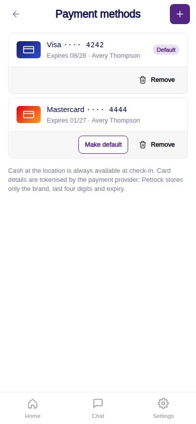
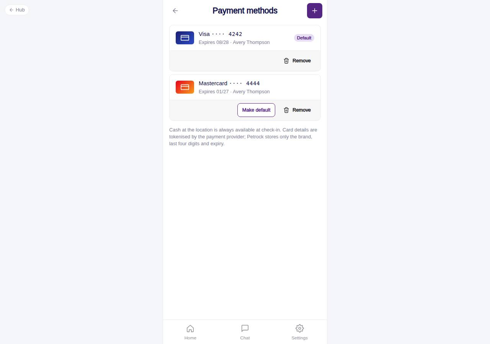

# C-74 · Payment methods

## Purpose

Manage saved cards for faster deposits: list, add, make default, remove. Cash at the location stays available at check-in.

## Screenshots

| 390 | 1280 |
| --- | --- |
|  |  |

Captured as the demo customer (Avery Thompson). Dark: `../screenshots/C-74/390-dark.jpg`.

## Sections (layout order)

1. CustomerScreenHeader with + (add)
2. PaymentCardTile list (default first) or EmptyState
3. Cash / tokenisation note
4. Add card Modal - name, number (brand detected, Luhn), expiry MM/YY, CVC, billing ZIP, default checkbox
5. Remove confirmation Modal

## Data

| Table | Read / write | Notes |
| --- | --- | --- |
| `payment_methods` | read / write | status active | removed; is_default |
| `customers` | read | owner |

## Rules

- `R-M22` - tokenised; only brand, last4, expiry, holder, provider token stored
- `R-H03` - the card fee itself is shown in estimates (pricing tables), not here

## Logic

- `detectBrand()` from the prefix (4 Visa, 51-55 / 22-27 Mastercard, 34 / 37 Amex, 6011 / 65 Discover); `luhn()` check; expiry must not be in the past.
- One default per customer; removing the default promotes the next active card. Removed cards keep a row (status removed) so past payments still resolve.

## Components

CustomerScreenHeader, PaymentCardTile, EmptyState, Button, IconButton, Input, Checkbox, Modal, Toast

## Real vs mock

Tokenisation is mock (`pm_mock_...`). `StripePaymentProvider.needsCardElement` will swap the number / expiry / CVC inputs for Stripe Elements and a SetupIntent.

## Responsive check (D-016)

Checked 2026-09-18 with Playwright (`scripts/screenshots-customer-settings-chat.mjs`) at 360, 390, 768, 1280 and 1920: no console errors, no horizontal overflow. The customer surface renders in a centered 430 px column from 600 px up (PhoneShell), so tablet and desktop widths show the phone layout with side gutters.

## Changelog

- `docs/changelog/_pending/customer-settings-chat.md` (to be merged into the next numbered entry)
