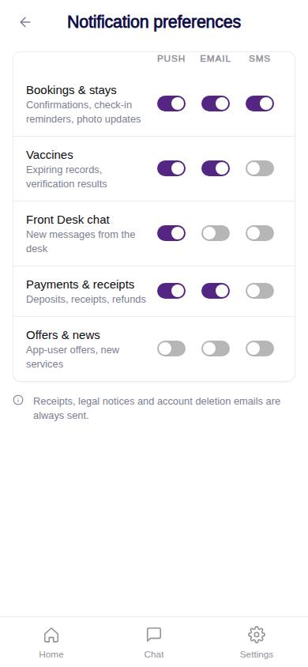
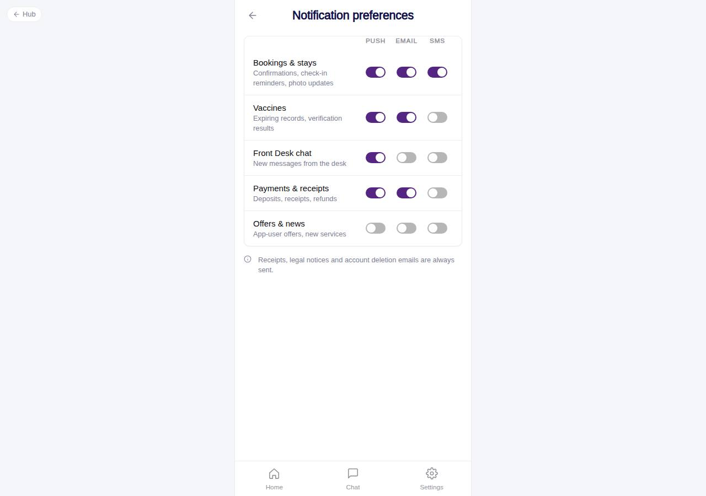

# C-75 · Notification preferences

## Purpose

Pick, per category (bookings, vaccines, chat, payments, offers) and channel (push, email, SMS), what reaches the customer. Each toggle saves immediately.

## Screenshots

| 390 | 1280 |
| --- | --- |
|  |  |

Captured as the demo customer (Avery Thompson).

## Sections (layout order)

1. CustomerScreenHeader
2. Matrix Card - header row PUSH / EMAIL / SMS, one row per category with label + hint and three Toggles
3. Always-sent note (receipts, legal notices, deletion emails)

## Data

| Table | Read / write | Notes |
| --- | --- | --- |
| `notification_prefs` | read / write | one row per user per category; created with defaults on first open |

## Rules

- `R-M23` - preferences per category and channel; offers default off; transactional notices always sent

## Logic

- Defaults: bookings on everywhere, vaccines push + email, chat push, payments push + email, promotions off.
- Labels come from `NOTIFICATION_CATEGORY_LABEL` (en / es).

## Components

CustomerScreenHeader, Card, Toggle, Icon

## Real vs mock

Real rows; push delivery needs Capacitor + a push provider, SMS / email need the Company-OS notification service.

## Responsive check (D-016)

Checked 2026-09-18 with Playwright (`scripts/screenshots-customer-settings-chat.mjs`) at 360, 390, 768, 1280 and 1920: no console errors, no horizontal overflow. The customer surface renders in a centered 430 px column from 600 px up (PhoneShell), so tablet and desktop widths show the phone layout with side gutters.

## Changelog

- `docs/changelog/_pending/customer-settings-chat.md` (to be merged into the next numbered entry)
