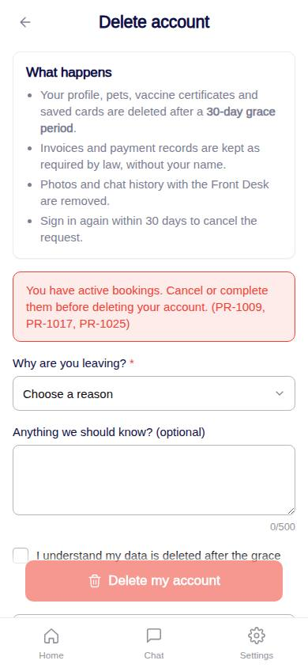
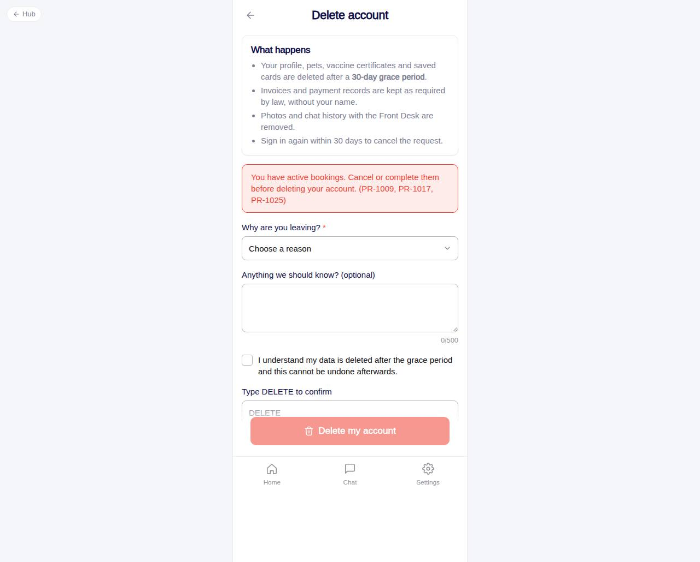

# C-76 · Delete account

## Purpose

App-store required account deletion with a 30-day grace period. Explains what happens, blocks while bookings are active, collects a reason, requires typing DELETE, confirms, schedules and signs the customer out.

## Screenshots

| 390 | 1280 |
| --- | --- |
|  |  |

Captured as the demo customer (Avery Thompson).

## Sections (layout order)

1. CustomerScreenHeader
2. Pending request card (when one exists) with Keep my account
3. What happens - four bullets
4. Active bookings warning (codes)
5. Reason Select + optional details
6. Acknowledgement Checkbox
7. Type DELETE Input
8. Sticky danger CTA -> confirm Modal

## Data

| Table | Read / write | Notes |
| --- | --- | --- |
| `account_deletion_requests` | read / write | status requested | cancelled | completed; scheduled_for |
| `bookings` | read | active statuses block the flow |
| `customers` | read | owner, home location |
| `audit_log` | write | `account.delete_requested` |

## Rules

- `R-M05` - delete account from settings
- `R-M21` - 30-day grace; blocked by requested / pending_vaccines / confirmed / checked_in bookings; cancellable by signing in again

## Logic

- `canSubmit` = customer && no active bookings && reason && acknowledged && typed DELETE && no pending request.
- On confirm: insert request (scheduled_for = today + 30), audit_log row, toast, `signOut()`, navigate to sign-in.

## Components

CustomerScreenHeader, Card, Select, Textarea, Checkbox, Input, Button, Modal, Badge, Toast

## Real vs mock

The anonymisation job that completes the request after 30 days is a Company-OS task (not in the mock).

## Responsive check (D-016)

Checked 2026-09-18 with Playwright (`scripts/screenshots-customer-settings-chat.mjs`) at 360, 390, 768, 1280 and 1920: no console errors, no horizontal overflow. The customer surface renders in a centered 430 px column from 600 px up (PhoneShell), so tablet and desktop widths show the phone layout with side gutters.

## Changelog

- `docs/changelog/_pending/customer-settings-chat.md` (to be merged into the next numbered entry)
