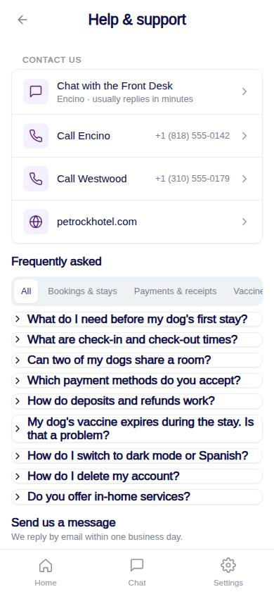
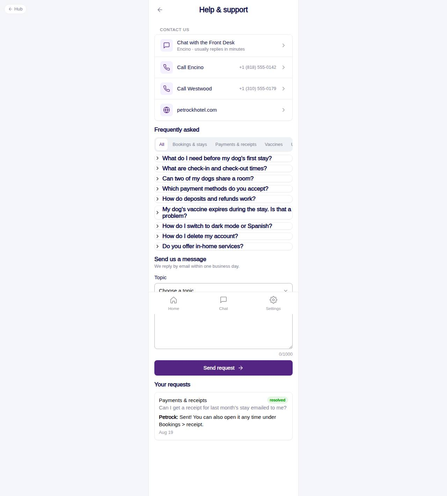

# C-77 · Help & support

## Purpose

Where a pet parent gets help: chat with the Front Desk, call a location, browse the FAQ by topic, send a support request and follow past requests with staff replies.

## Screenshots

| 390 | 1280 |
| --- | --- |
|  |  |

Captured as the demo customer (Avery Thompson).

## Sections (layout order)

1. CustomerScreenHeader
2. Contact us - Chat with the Front Desk (inbox), Call <location> per active location (tel:), website
3. Frequently asked - topic pills (Tabs) + collapsible Sections per question
4. Send us a message - topic Select, message Textarea, Send
5. Your requests - past support_requests with status badge and staff reply

## Data

| Table | Read / write | Notes |
| --- | --- | --- |
| `faq_items` | read | active, by sort_order |
| `support_requests` | read / write | user requests; location_id = home location |
| `locations` | read | phones, names |
| `customers` | read | home location |

## Rules

- `R-M11` - voice / video calls out of scope; tel: link instead
- `R-A02` - In Home is inquiry-only via chat (FAQ answer points to the chat)

## Logic

- Request validation: topic required, message >= 10 chars.
- Phone numbers dial through `tel:`; the website opens in a new tab.

## Components

CustomerScreenHeader, AccountMenuRow, Card, Section, Tabs, Select, Textarea, Button, Badge, EmptyState, Toast

## Real vs mock

Requests land in `support_requests` for the desk / owner to answer (staff page not built in this module; see gaps).

## Responsive check (D-016)

Checked 2026-09-18 with Playwright (`scripts/screenshots-customer-settings-chat.mjs`) at 360, 390, 768, 1280 and 1920: no console errors, no horizontal overflow. The customer surface renders in a centered 430 px column from 600 px up (PhoneShell), so tablet and desktop widths show the phone layout with side gutters.

## Changelog

- `docs/changelog/_pending/customer-settings-chat.md` (to be merged into the next numbered entry)
