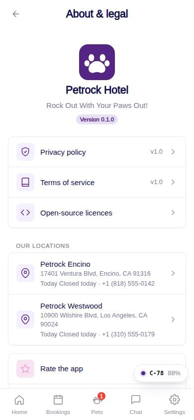
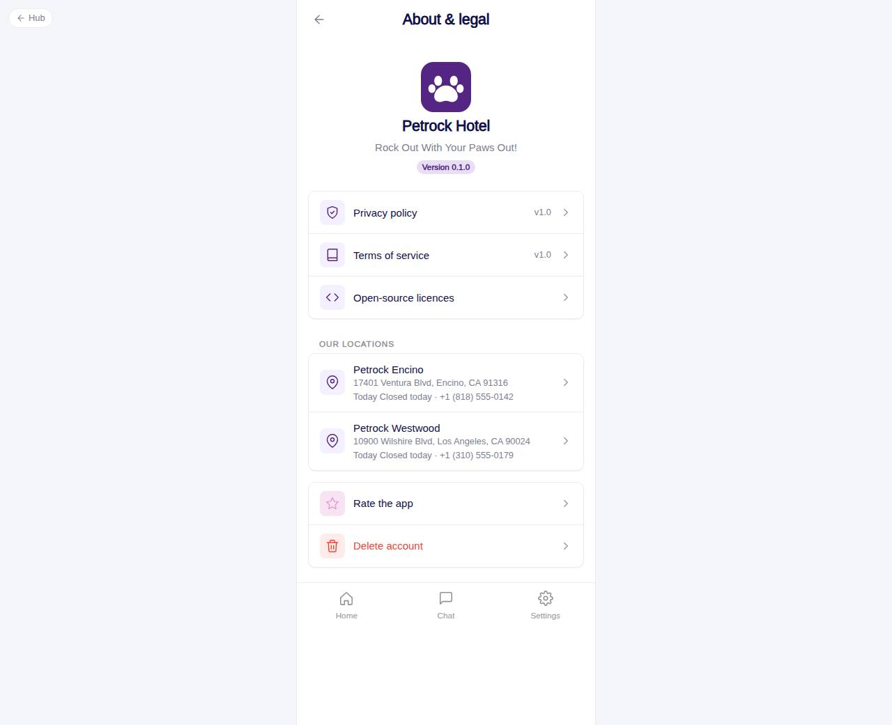

# C-78 · About & legal

## Purpose

App identity and legal entry points: version, privacy policy, terms, licences, both locations with today's hours and phone, rate and delete links, company footer.

## Screenshots

| 390 | 1280 |
| --- | --- |
|  |  |

Captured as the demo customer (Avery Thompson).

## Sections (layout order)

1. CustomerScreenHeader
2. App mark, name, tagline, version Badge
3. Legal list - Privacy policy, Terms of service, Open-source licences (version values)
4. Our locations - name, address, today's hours, phone; tap opens Maps
5. Rate the app / Delete account
6. Footer - legal name, website

## Data

| Table | Read / write | Notes |
| --- | --- | --- |
| `legal_documents` | read | published documents by kind |
| `locations` | read | active locations, hours |

## Rules

- (none specific; the page follows the account rules of the module)

## Logic

- Today's hours from `locations.hours[weekday]`; "Closed today" when null.
- Version is `__APP_VERSION__` (package.json).

## Components

CustomerScreenHeader, AccountMenuRow, Card, Badge

## Real vs mock

Real. Company constants from `src/tenant/locations.ts`.

## Responsive check (D-016)

Checked 2026-09-18 with Playwright (`scripts/screenshots-customer-settings-chat.mjs`) at 360, 390, 768, 1280 and 1920: no console errors, no horizontal overflow. The customer surface renders in a centered 430 px column from 600 px up (PhoneShell), so tablet and desktop widths show the phone layout with side gutters.

## Changelog

- `docs/changelog/_pending/customer-settings-chat.md` (to be merged into the next numbered entry)
- 0019 - QA fixes: Spec rules: R-X39, R-M05.
