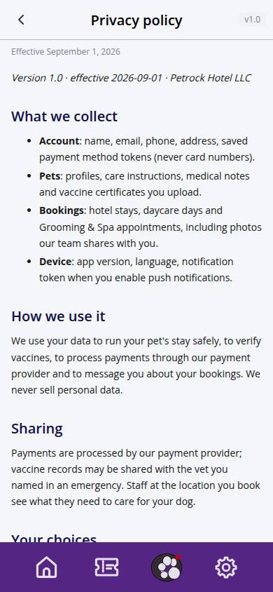
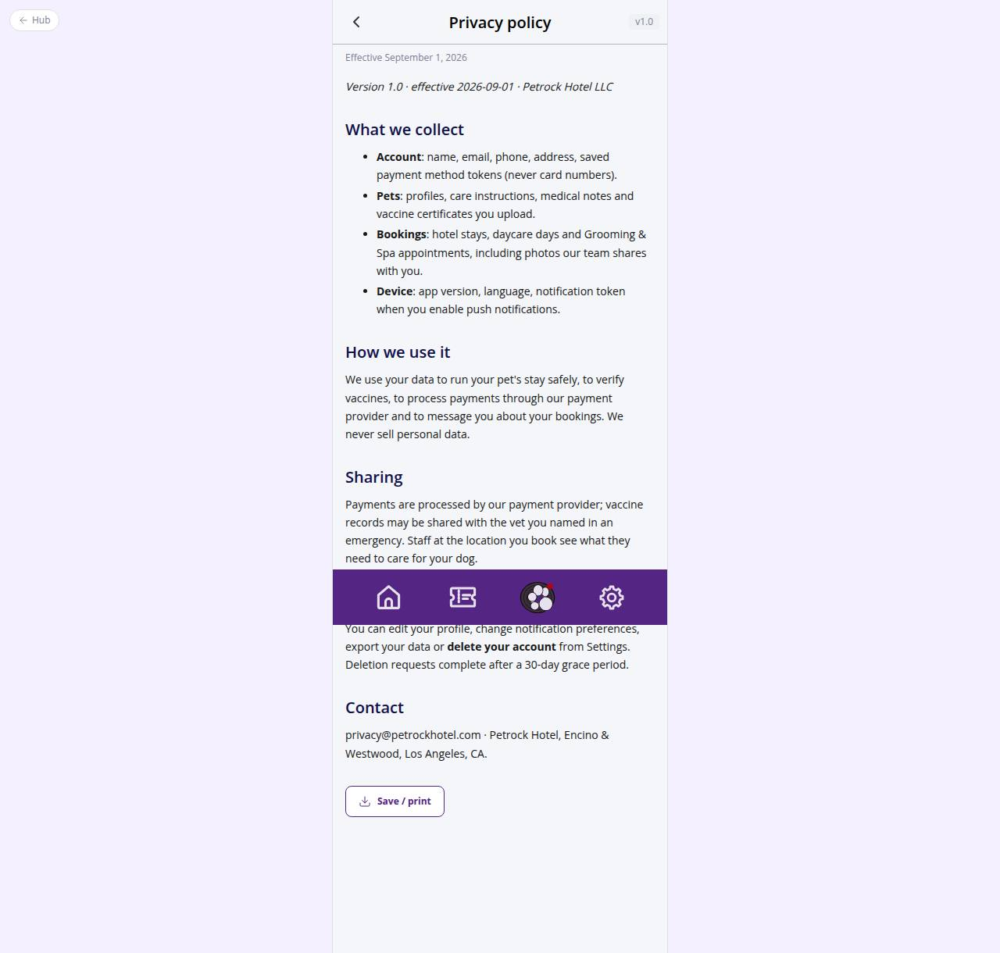

# C-79 · Legal document

## Purpose

Reads one published legal document (privacy-policy, terms-of-service, open-source-licenses) as markdown with its version and effective date. Unknown slugs show a friendly empty state.

## Screenshots

| 390 | 1280 |
| --- | --- |
|  |  |

Captured as the demo customer (Avery Thompson).

## Sections (layout order)

1. CustomerScreenHeader with version Badge
2. Effective date
3. MarkdownViewer body
4. Save / print

## Data

| Table | Read / write | Notes |
| --- | --- | --- |
| `legal_documents` | read | by slug, published = true |

## Rules

- (none specific; the page follows the account rules of the module)

## Logic

- The leading H1 is stripped from the body because the header already shows the title.

## Components

CustomerScreenHeader, MarkdownViewer, EmptyState, Badge, Button

## Real vs mock

Document bodies are seed markdown to be replaced by Justin's legal text (A-4x settings page can edit `legal_documents`).

## Responsive check (D-016)

Checked 2026-09-18 with Playwright (`scripts/screenshots-customer-settings-chat.mjs`) at 360, 390, 768, 1280 and 1920: no console errors, no horizontal overflow. The customer surface renders in a centered 430 px column from 600 px up (PhoneShell), so tablet and desktop widths show the phone layout with side gutters.

## Changelog

- `docs/changelog/_pending/customer-settings-chat.md` (to be merged into the next numbered entry)
- 0019 - QA fixes: Spec rules: R-M05, R-X39.
