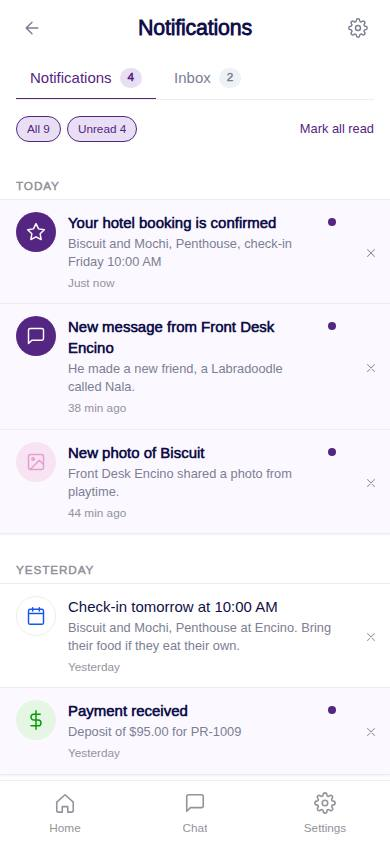
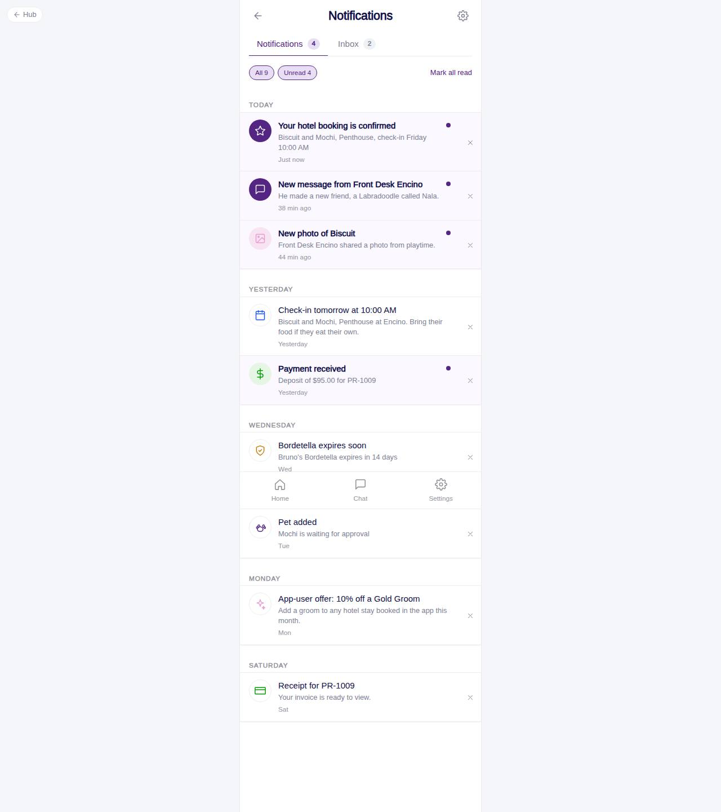

# C-80 · Notification centre

## Purpose

Every in-app notification grouped by day with an unread filter, mark-all-read, tap-to-open and dismiss. The Inbox tab shows the Front Desk threads so both Figma variants (Notification | Front Desk Chat / Inbox) are covered.

## Screenshots

| 390 | 1280 |
| --- | --- |
|  |  |

Captured as the demo customer (Avery Thompson). Dark: `../screenshots/C-80/390-dark.jpg`.

## Sections (layout order)

1. CustomerScreenHeader (gear -> preferences)
2. Tabs Notifications (unread count) | Inbox (unread chat count)
3. Filters - All / Unread chips, Mark all read
4. Day groups (Today, Yesterday, weekday, date) of NotificationRow
5. EmptyState when nothing matches
6. Inbox tab - ConversationList

## Data

| Table | Read / write | Notes |
| --- | --- | --- |
| `notifications` | read / write | read flag, delete on dismiss |
| `conversations` | read | unread_customer for the Inbox count |

## Rules

- `R-M07` - notification kinds mapped to icons in `NOTIFICATION_KIND_ICON`
- `R-M08` - relative timestamps with consistent grammar

## Logic

- Tap: mark read then navigate to `notifications.link` when present.
- Tab state lives in the query string (`?tab=inbox`).

## Components

CustomerScreenHeader, Tabs, Chip, Button, Card, NotificationRow, ChatConversationRow, EmptyState, IconButton

## Real vs mock

Rows are mock seed + rows other modules insert. Push delivery comes with Capacitor.

## Responsive check (D-016)

Checked 2026-09-18 with Playwright (`scripts/screenshots-customer-settings-chat.mjs`) at 360, 390, 768, 1280 and 1920: no console errors, no horizontal overflow. The customer surface renders in a centered 430 px column from 600 px up (PhoneShell), so tablet and desktop widths show the phone layout with side gutters.

## Changelog

- `docs/changelog/_pending/customer-settings-chat.md` (to be merged into the next numbered entry)
