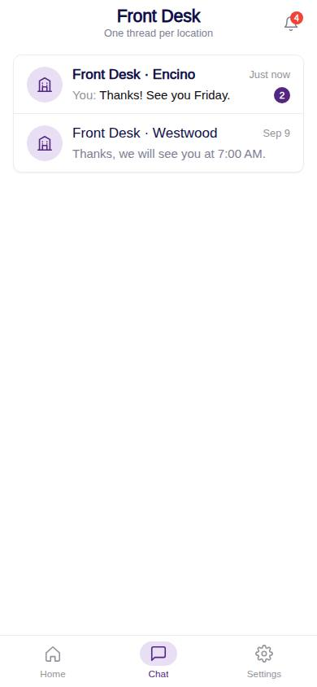
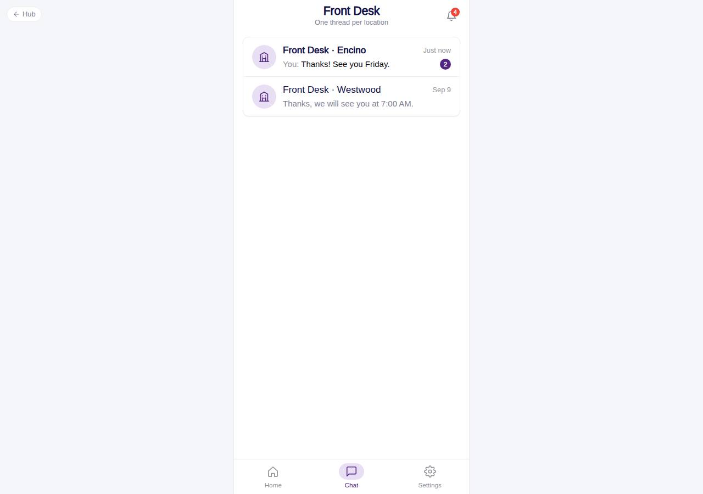

# C-81 · Inbox

## Purpose

The **Chat** tab: one Front Desk conversation per location with last message, relative time and unread count. A location without a thread offers "Message Westwood" which starts one.

## Screenshots

| 390 | 1280 |
| --- | --- |
|  |  |

Captured as the demo customer (Avery Thompson).

## Sections (layout order)

1. CustomerScreenHeader (no back; bell with unread notifications)
2. Preview chip (staff previewing)
3. ConversationList - ChatConversationRow per active location

## Data

| Table | Read / write | Notes |
| --- | --- | --- |
| `conversations` | read / write | one per customer per location; insert on start |
| `messages` | read / write | preview; system Session start on new thread |
| `locations` | read | names |
| `customers` | read | owner |

## Rules

- `R-M09` / `R-M20` - one thread per customer per location with a Session start marker
- `R-M08` - relative time

## Logic

- Threads sort by last message; preview prefixes "You:" when the customer wrote last; photo-only messages preview as "📷 Photo".

## Components

CustomerScreenHeader, IconButton, Chip, ChatConversationRow, Card, EmptyState

## Real vs mock

Real against the mock provider. The staff side (F-61 messages inbox) reads the same tables.

## Responsive check (D-016)

Checked 2026-09-18 with Playwright (`scripts/screenshots-customer-settings-chat.mjs`) at 360, 390, 768, 1280 and 1920: no console errors, no horizontal overflow. The customer surface renders in a centered 430 px column from 600 px up (PhoneShell), so tablet and desktop widths show the phone layout with side gutters.

## Changelog

- `docs/changelog/_pending/customer-settings-chat.md` (to be merged into the next numbered entry)
