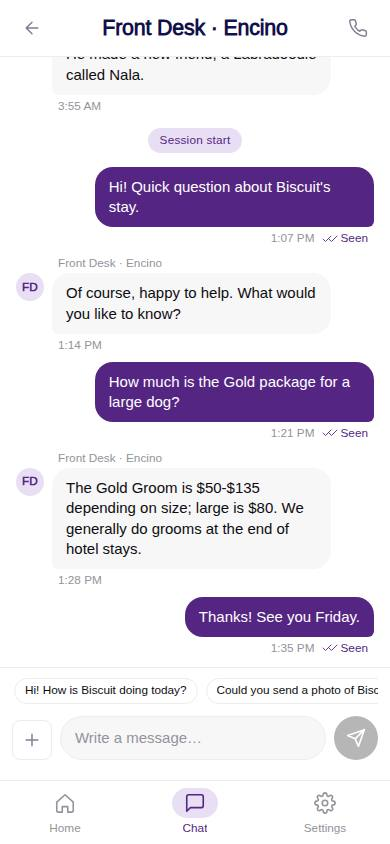
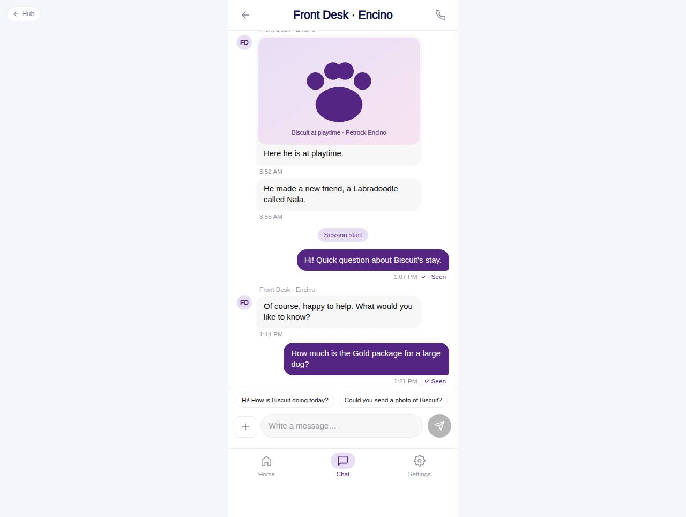

# C-82 · Front Desk chat

## Purpose

Message the Front Desk of one location. Best-practice redesign (D-018): own messages right in primary purple, Front Desk left with avatar, day markers, read receipts (Delivered / Seen), photo attachments with lightbox, quick replies, typing indicator and today's hours in the header. A demo staff reply arrives a few seconds after each message.

## Screenshots

| 390 | 1280 |
| --- | --- |
|  |  |

Captured as the demo customer (Avery Thompson). Dark: `../screenshots/C-82/390-dark.jpg`. After a send (demo reply, Seen receipt): `../screenshots/C-82/390-after-send.jpg`.

## Sections (layout order)

1. CustomerScreenHeader - title Front Desk · <location>, subtitle hours, call button
2. Scrolling timeline - ChatTimelineMarker (day, Session start), ChatMessageBubble (grouped within 5 min)
3. Typing indicator (demo reply)
4. ChatComposer - quick replies with the pet's name, attach photo (jpg / png / webp <= 2 MB), send
5. Photo lightbox Modal
6. Not-found EmptyState

## Data

| Table | Read / write | Notes |
| --- | --- | --- |
| `conversations` | read / write | unread counters, preview |
| `messages` | read / write | customer messages; staff messages marked read on open |
| `locations` | read | hours, phone |
| `pets` | read | first pet name for quick replies |
| `chat_quick_replies` | read | audience customer |

## Rules

- `R-M24` - read receipts and delivery states
- `R-M25` - platform bubble convention (inverts the Figma draft)
- `R-M20` / `R-M09` - one thread per location
- `R-M28` - image attachments 2 MB (in dev: real storage)
- `R-M10` - the demo reply never types a price

## Logic

- On open: staff messages `read = true`, `conversations.unread_customer = 0`.
- Send: insert message, update preview / last_message_at / unread_staff. `chatMock.ts` schedules a typing indicator (1.2 s) and a canned staff reply (3.2 s) that marks the customer's messages Seen and bumps unread_customer.
- Only the owning customer can send; staff previewing see the thread read-only.

## Components

CustomerScreenHeader, ChatMessageBubble, ChatTimelineMarker, ChatComposer, Modal, IconButton, EmptyState, Button, Toast

## Real vs mock

Messages and read flags are real rows. The staff reply is a demo (`chatMock.ts`) to be deleted when F-61 / Company-OS realtime exist. Attachments are data URLs in localStorage (keep them small).

## Responsive check (D-016)

Checked 2026-09-18 with Playwright (`scripts/screenshots-customer-settings-chat.mjs`) at 360, 390, 768, 1280 and 1920: no console errors, no horizontal overflow. The customer surface renders in a centered 430 px column from 600 px up (PhoneShell), so tablet and desktop widths show the phone layout with side gutters.

## Changelog

- `docs/changelog/_pending/customer-settings-chat.md` (to be merged into the next numbered entry)
