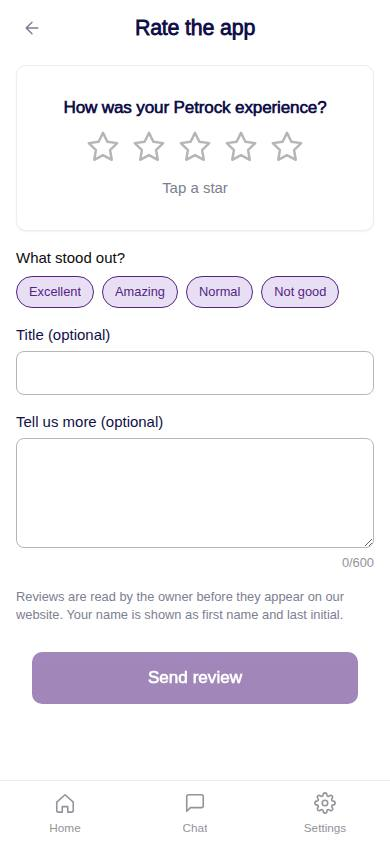
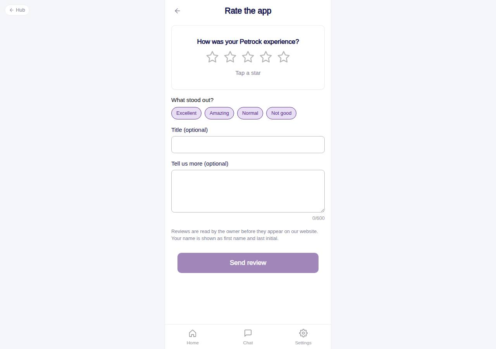

# C-83 · Rate the app

## Purpose

Leave a 1-5 star rating with tags (Excellent, Amazing, Normal, Not good) and a comment. Reviews are pending until the owner moderates them (A-35); the store review sheet follows with Capacitor.

## Screenshots

| 390 | 1280 |
| --- | --- |
|  |  |

Captured as the demo customer (Avery Thompson).

## Sections (layout order)

1. CustomerScreenHeader
2. Stars Card - question, StarRatingInput, hint per star
3. Tags Chips
4. Title + comment
5. Note about moderation
6. Sticky Send review
7. Thank-you EmptyState with Done / Rate on the store

## Data

| Table | Read / write | Notes |
| --- | --- | --- |
| `reviews` | write | status pending, rating, tags, title, body, home location |
| `customers` | read | owner |

## Rules

- `R-M27` - rate the app writes a pending review
- `R-M12` - moderation publish / archive

## Logic

- Submit enabled once a star is chosen; tags optional; comment max 600 chars.

## Components

CustomerScreenHeader, StarRatingInput, Chip, Input, Textarea, Button, Card, EmptyState, Toast

## Real vs mock

Store review prompt is a toast placeholder until the app is packaged.

## Responsive check (D-016)

Checked 2026-09-18 with Playwright (`scripts/screenshots-customer-settings-chat.mjs`) at 360, 390, 768, 1280 and 1920: no console errors, no horizontal overflow. The customer surface renders in a centered 430 px column from 600 px up (PhoneShell), so tablet and desktop widths show the phone layout with side gutters.

## Changelog

- `docs/changelog/_pending/customer-settings-chat.md` (to be merged into the next numbered entry)
