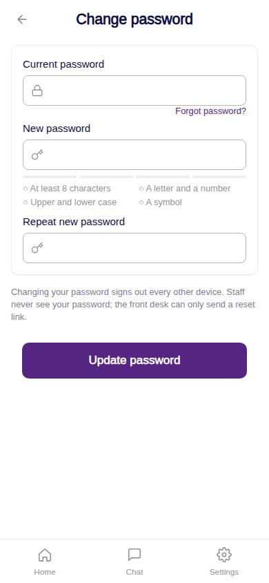
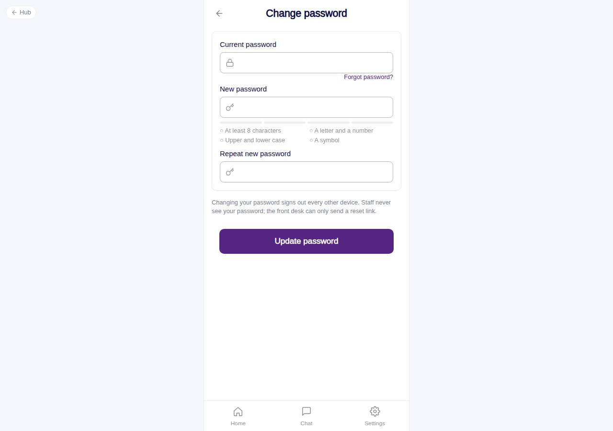

# C-84 · Change password

## Purpose

Change the password with a strength meter and rule checklist; confirms with the current password and signs other devices out (mock).

## Screenshots

| 390 | 1280 |
| --- | --- |
|  |  |

Captured as the demo customer (Avery Thompson).

## Sections (layout order)

1. CustomerScreenHeader (history back)
2. Card - current password, Forgot link, new password + PasswordStrengthBar, repeat
3. Note
4. Sticky Update password

## Data

| Table | Read / write | Notes |
| --- | --- | --- |
| `audit_log` | write | `password.change` |
| `users` | read | account |

## Rules

- `R-M01` - password changes through its own flow, never inline

## Logic

- New password needs score >= 2 (8+ chars with a letter and a number), must differ from the current one and match the repeat.

## Components

CustomerScreenHeader, Input, PasswordStrengthBar, Button, Card, Toast

## Real vs mock

No real credential store yet; Company-OS auth performs the actual change.

## Responsive check (D-016)

Checked 2026-09-18 with Playwright (`scripts/screenshots-customer-settings-chat.mjs`) at 360, 390, 768, 1280 and 1920: no console errors, no horizontal overflow. The customer surface renders in a centered 430 px column from 600 px up (PhoneShell), so tablet and desktop widths show the phone layout with side gutters.

## Changelog

- `docs/changelog/_pending/customer-settings-chat.md` (to be merged into the next numbered entry)
