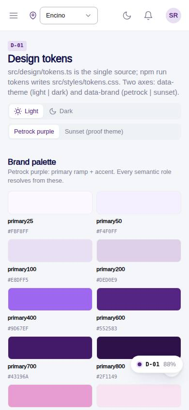
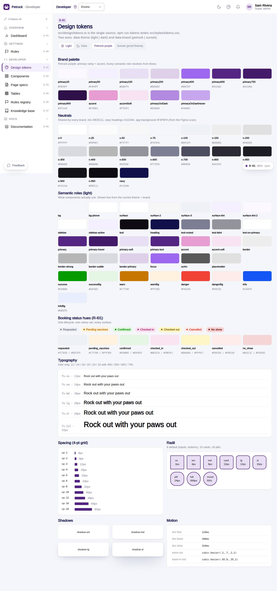

# D-01 · Design tokens

## Purpose

Every design value in one place, rendered live: brand palettes, neutrals, semantic roles per theme, booking status hues, typography, spacing, radii, shadows, motion. Theme and brand switches at the top.

## Screenshots

| 390 | 1280 |
| --- | --- |
|  |  |

Dark: `../screenshots/D-01/390-dark.jpg`, `../screenshots/D-01/1280-dark.jpg`.

## Sections (layout order)

1. PageHeader with theme + brand switch
2. Brand palette
3. Neutrals
4. Semantic roles (live)
5. Booking status hues
6. Typography
7. Spacing & radii
8. Shadows & motion

## Data

| Table | Read / write | Notes |
| --- | --- | --- |
| - | - | none |

## Rules

- R-M04 - dark mode

## Logic

- buildTokensCss() in src/design/tokens.ts; npm run tokens writes src/styles/tokens.css

## Components

PageHeader, Section, Card, SegmentedControl, StatusBadge

## Real vs mock

Real.

## Responsive check (D-016)

Checked at 360, 390, 768, 1280, 1920 on 2026-09-18 (Playwright): no horizontal scroll; DesktopShell sidebar becomes an overlay drawer under 900 px; DataTable rows become cards under 768 px.

## Changelog

- `docs/changelog/0007-foundation.md`
