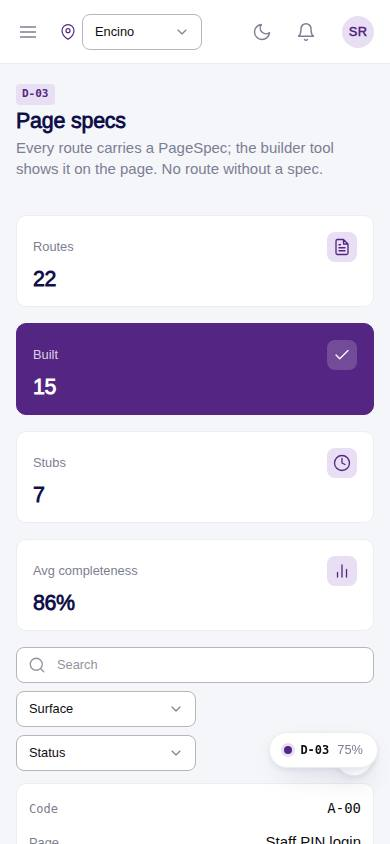
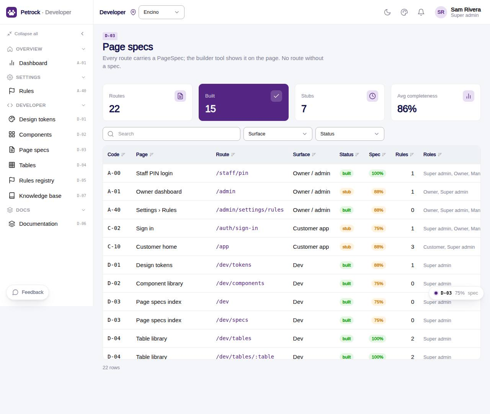

# D-03 · Page specs index

## Purpose

Every route with page code, surface, built/stub status, roles, rule count and spec completeness; click a row to open its InspectorPanel.

## Screenshots

| 390 | 1280 |
| --- | --- |
|  |  |

## Sections (layout order)

1. PageHeader
2. StatTiles: routes, built, stubs, average completeness
3. DataTable with surface and status filters
4. InspectorPanel for the selected spec

## Data

| Table | Read / write | Notes |
| --- | --- | --- |
| - | - | none |

## Rules

- none

## Logic

- specCompleteness() scores purpose, layout, data, roles, logic, components, rules, states
- status = PageStub element ? stub : built

## Components

PageHeader, StatTile, DataTable, Badge, Button, InspectorPanel

## Real vs mock

Real.

## Responsive check (D-016)

Checked at 360, 390, 768, 1280, 1920 on 2026-09-18 (Playwright): no horizontal scroll; DesktopShell sidebar becomes an overlay drawer under 900 px; DataTable rows become cards under 768 px.

## Changelog

- `docs/changelog/0007-foundation.md`
