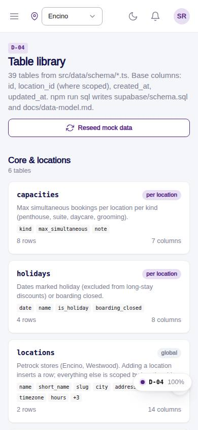
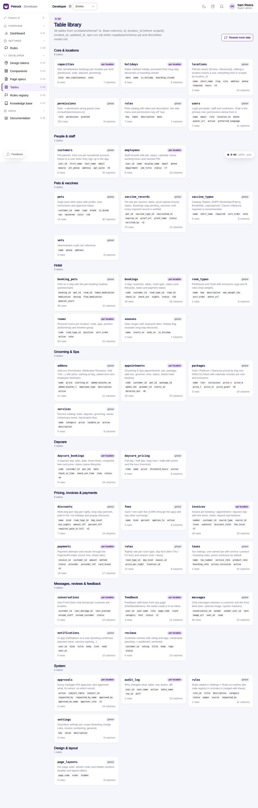

# D-04 · Table library and table manager

## Purpose

The table library lists every TableDef grouped by area with row counts, columns and scope; the generic table manager lists, searches, filters, adds, edits and deletes rows of any table. Delete is PIN-gated and audited.

## Screenshots

| 390 | 1280 |
| --- | --- |
|  |  |

Dark: `../screenshots/D-04/390-dark.jpg`, `../screenshots/D-04/1280-dark.jpg`.

## Sections (layout order)

1. PageHeader + reseed button
2. Group sections with table cards
3. Table manager: PageHeader, DataTable (enum filters), row Drawer (form generated from columns), PinApprovalModal

## Data

| Table | Read / write | Notes |
| --- | --- | --- |
| `every table` | read/write | generic |
| `approvals` | write | PIN approvals for record.delete |
| `audit_log` | write | insert / update / delete diffs |

## Rules

- R-J03 - base columns are read-only
- R-P01 - deleting records needs a manager PIN

## Logic

- Form fields are generated from ColumnDef types (enum -> Select, references -> Select of the referenced table, bool -> Checkbox, json -> Textarea, money/int -> number)
- New rows in location-scoped tables default to the current location

## Components

PageHeader, Section, Card, Badge, Button, Input, Select, Textarea, Checkbox, DataTable, Drawer, PinApprovalModal, EmptyState, Toast

## Real vs mock

Mock provider; the same manager will drive Company-OS entities through CompanyOsProvider.

## Responsive check (D-016)

Checked at 360, 390, 768, 1280, 1920 on 2026-09-18 (Playwright): no horizontal scroll; DesktopShell sidebar becomes an overlay drawer under 900 px; DataTable rows become cards under 768 px.

## Changelog

- `docs/changelog/0007-foundation.md`
