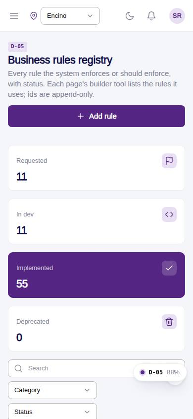
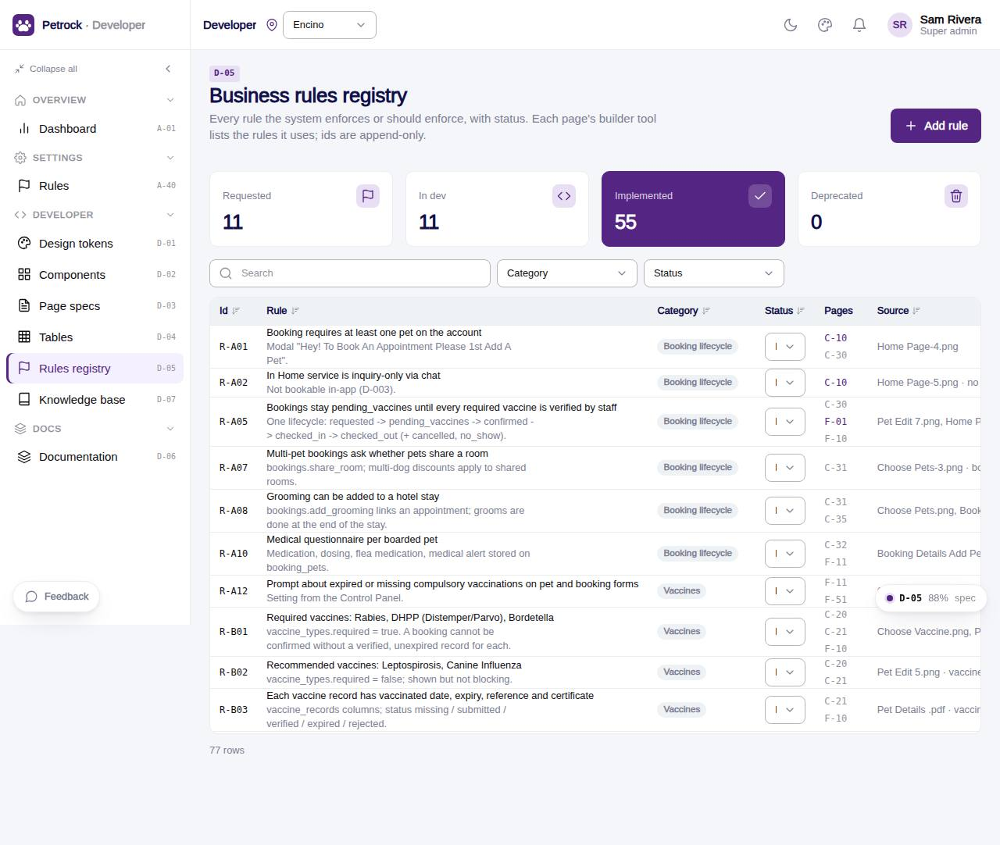

# D-05 · Business rules registry

## Purpose

Every business rule with id, category, status (requested / in dev / implemented / deprecated), the pages that use it and its source. Owners add rules and change statuses; each page inspector links back here.

## Screenshots

| 390 | 1280 |
| --- | --- |
|  |  |

Dark: `../screenshots/D-05/390-dark.jpg`, `../screenshots/D-05/1280-dark.jpg`.

## Sections (layout order)

1. PageHeader + Add rule
2. Status tiles
3. DataTable with category / status filters and search
4. Add rule Drawer

## Data

| Table | Read / write | Notes |
| --- | --- | --- |
| `rules` | read/write | runtime rows merged over the code registry |

## Rules

- (displays all rules)

## Logic

- Code registry (src/rules/*.ts) merged with rules-table rows; runtime rows win on id
- Status change on a code rule inserts an override row
- Next owner id is R-Xnn

## Components

PageHeader, StatTile, DataTable, Badge, Select, Drawer, Input, Textarea, Button, Toast

## Real vs mock

Real against the mock provider. 76 code rules seeded at v0.1.0.

## Responsive check (D-016)

Checked at 360, 390, 768, 1280, 1920 on 2026-09-18 (Playwright): no horizontal scroll; DesktopShell sidebar becomes an overlay drawer under 900 px; DataTable rows become cards under 768 px.

## Changelog

- `docs/changelog/0007-foundation.md`
