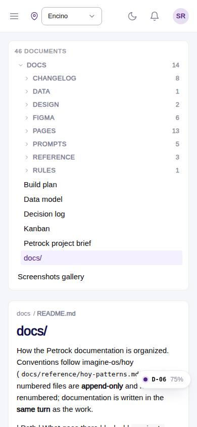
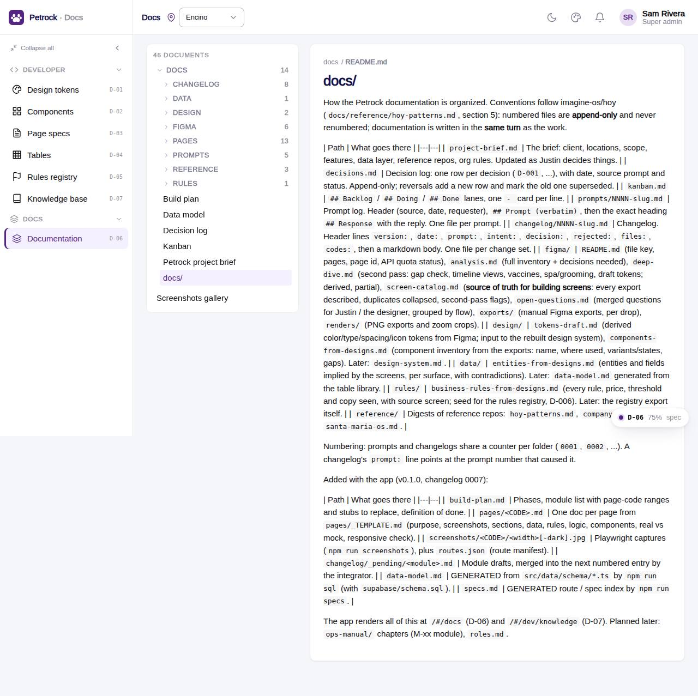

# D-06 · Docs viewer

## Purpose

Renders every markdown file under docs/ in-app with a folder tree; prompt files split into prompt | response; screenshots gallery at /docs/screenshots; page docs link to the live page.

## Screenshots

| 390 | 1280 |
| --- | --- |
|  |  |

## Sections (layout order)

1. DocsSidebar (folder tree, screenshots link)
2. Document card with breadcrumbs and MarkdownViewer
3. Screenshots gallery grouped by page code

## Data

| Table | Read / write | Notes |
| --- | --- | --- |
| - | - | none |

## Rules

- none

## Logic

- docsIndex globs docs/**/*.md (raw) and docs/screenshots + docs/figma/renders images (url); Figma exports (69 MB) are not bundled
- Relative links to other docs become router links

## Components

MarkdownViewer, Figure, Card, Chip, EmptyState, PageHeader

## Real vs mock

Real. Images referenced from docs/figma/exports do not render in-app (not bundled).

## Responsive check (D-016)

Checked at 360, 390, 768, 1280, 1920 on 2026-09-18 (Playwright): no horizontal scroll; DesktopShell sidebar becomes an overlay drawer under 900 px; DataTable rows become cards under 768 px.

## Changelog

- `docs/changelog/0007-foundation.md`
