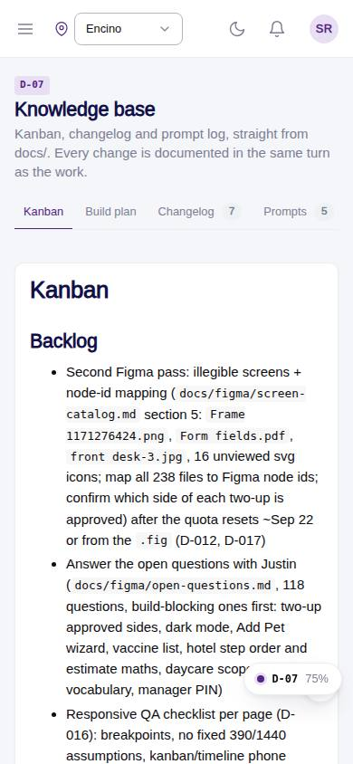
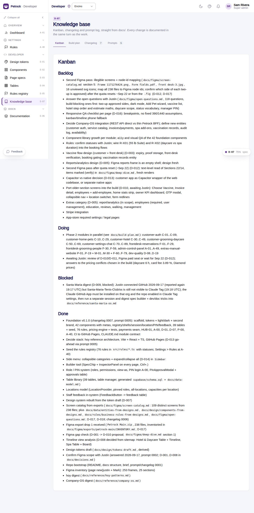

# D-07 · Knowledge base

## Purpose

Kanban, build plan, changelog (with pending module drafts) and prompt log in tabs.

## Screenshots

| 390 | 1280 |
| --- | --- |
|  |  |

## Sections (layout order)

1. PageHeader with tabs
2. Kanban (docs/kanban.md)
3. Build plan (docs/build-plan.md)
4. Changelog cards with header meta
5. Prompts split prompt | response

## Data

| Table | Read / write | Notes |
| --- | --- | --- |
| - | - | none |

## Rules

- none

## Logic

- headerMeta() parses version/date/prompt/codes header lines

## Components

PageHeader, Tabs, Card, Badge, MarkdownViewer, EmptyState

## Real vs mock

Real.

## Responsive check (D-016)

Checked at 360, 390, 768, 1280, 1920 on 2026-09-18 (Playwright): no horizontal scroll; DesktopShell sidebar becomes an overlay drawer under 900 px; DataTable rows become cards under 768 px.

## Changelog

- `docs/changelog/0007-foundation.md`
