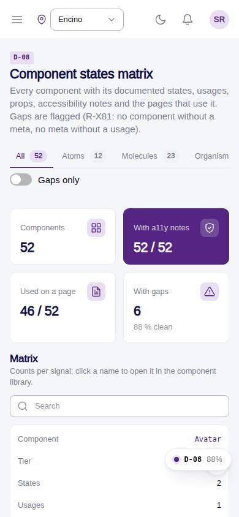
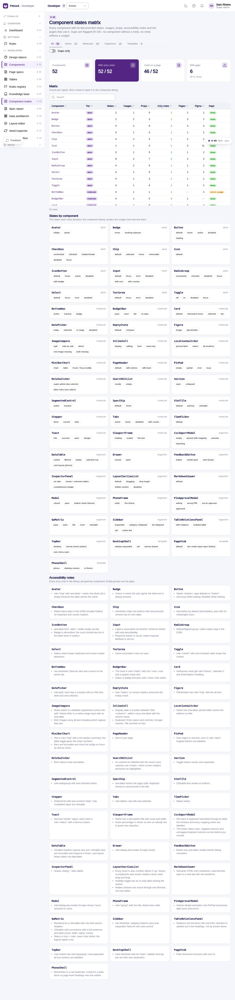

# D-08 · Component states matrix

## Purpose

A super admin auditing the component library sees every component with the number of declared states, usages, props, accessibility notes, pages that use it and Figma sources in one grid; gaps (no usage, no a11y notes, not used on any page) are flagged so R-X81 (no component without a meta, no meta without a usage) is checked mechanically instead of by reading 50 files.

## Screenshots

| 390 | 1280 |
| --- | --- |
|  |  |

Dark: not captured (not a key page); the theme toggle in the top bar switches it live.

## Sections (layout order)

1. PageHeader with tier tabs and a "Gaps only" toggle
2. StatTiles: components, with a11y notes, used on a page, with gaps (+ % clean)
3. Matrix (DataTable): one row per component, counts per signal, gap badges, name links to /dev/components#Name
4. States by component: cards with one chip per declared state
5. Accessibility notes: every a11y note grouped by component; empty groups are the gaps

## Data

| Table | Read / write | Notes |
| --- | --- | --- |
| `(none)` | read | componentLibrary from src/design/library.ts (globbed metas), not a table |

## Rules

- R-X81 - gaps are computed from the metas and shown as badges

## Logic

- gap = no usages OR no a11y notes OR usedBy empty (plus "no states" / "no props" as soft gaps)
- coverage % = components without gaps / total

## Components

PageHeader, StatTile, Tabs, Toggle, DataTable, Badge, Chip, Section, Card

## Real vs mock

All real: the page reads the metas that ship in the bundle. Nothing changes with Company-OS.

## Responsive check (D-016)

Checked at 360, 390, 768, 1280, 1920 in light and dark on 2026-09-18 with `npm run qa:responsive -- --codes=D-08` (no horizontal scroll, no console errors). Tabs scroll horizontally inside the toolbar under 480 px; the matrix falls back to DataTable cards under 768 px.

## Changelog

- `docs/changelog/_pending/dev-quality.md` (to be merged into the next numbered entry)
