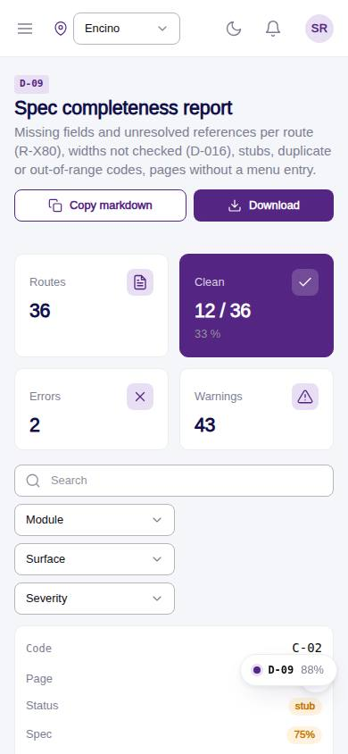
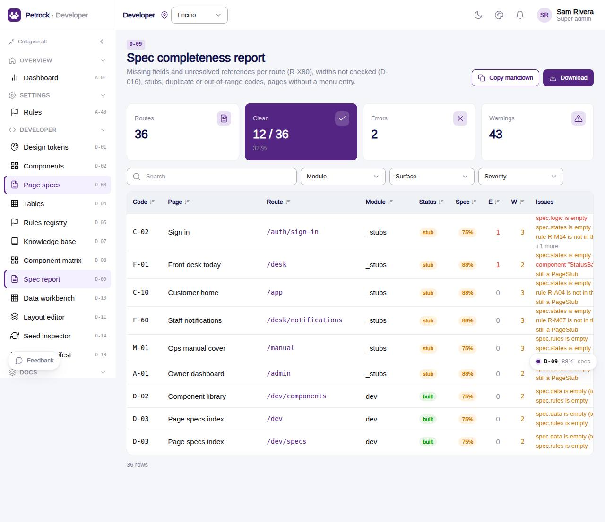

# D-09 · Spec completeness report

## Purpose

The integrator and module builders see, per route, which PageSpec fields are empty, which spec.data tables do not exist in the schema, which spec.components have no meta, which rule ids are not in the registry, which D-016 widths were not checked, stubs, duplicate or out-of-range page codes and staff pages without a menu entry. The report exports to markdown for docs/qa.

## Screenshots

| 390 | 1280 |
| --- | --- |
|  |  |

Dark: `../screenshots/D-09/390-dark.jpg`, `../screenshots/D-09/1280-dark.jpg`.

## Sections (layout order)

1. PageHeader with Copy markdown / Download
2. StatTiles: routes, clean, errors, warnings
3. DataTable with module / surface / severity filters; first three issues inline
4. Drawer per route: every issue with its kind badge, checked widths, rule ids, Open page / Inspect spec
5. InspectorPanel for the selected spec

## Data

| Table | Read / write | Notes |
| --- | --- | --- |
| `(none)` | read | routes from the registry; tables, components and rules from their registries |

## Rules

- R-X80 - every reference must resolve; every empty field is an error (states / rules a warning)
- R-X82 - missing checkedAt widths are warnings

## Logic

- buildSpecReport() in src/modules/dev-quality/specReport.ts; sorted by errors, then warnings, then code
- Module of a route = the registry module whose routes array contains it; expected module from CODE_RANGES (docs/build-plan.md)
- no_nav only for built staff routes without params

## Components

PageHeader, StatTile, DataTable, Badge, Button, Drawer, InspectorPanel, Chip, Toast

## Real vs mock

All real, computed in the browser from the bundle.

## Responsive check (D-016)

Checked at 360, 390, 768, 1280, 1920 in light and dark on 2026-09-18 with `npm run qa:responsive -- --codes=D-09` (no horizontal scroll, no console errors). Long issue lists truncate to three lines in the table; the drawer shows all.

## Changelog

- `docs/changelog/_pending/dev-quality.md` (to be merged into the next numbered entry)
