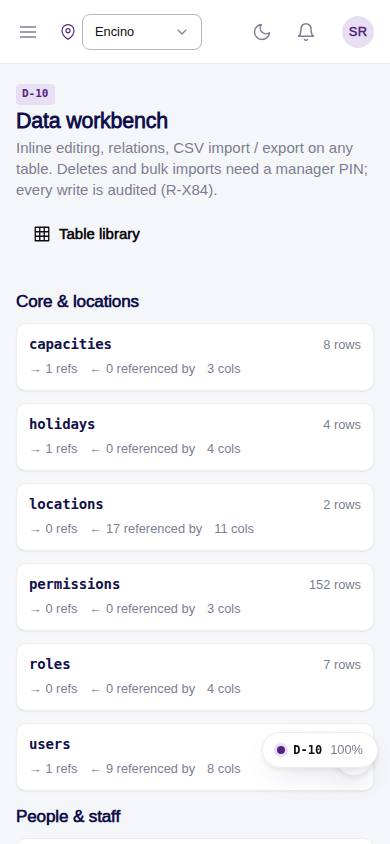
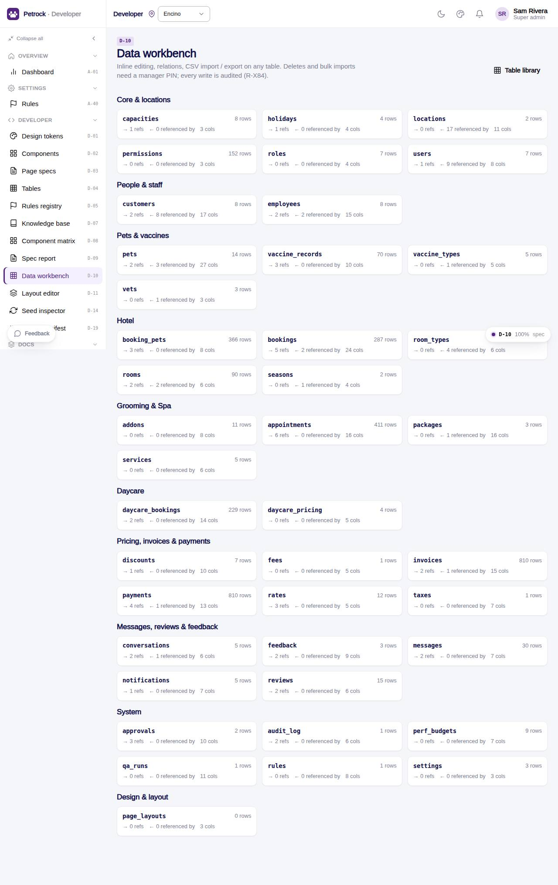

# D-10 · Data workbench

## Purpose

A super admin fixing or bulk-loading data edits any cell of any table in place, follows relations in both directions, exports the current view as CSV and imports CSV (insert or upsert) with header mapping and type coercion. Deletes and imports of more than one row need a manager PIN and every write lands in audit_log (R-X84). D-04 stays the form editor; D-10 is the power tool.

## Screenshots

| 390 | 1280 |
| --- | --- |
|  |  |

Dark: `../screenshots/D-10/390-dark.jpg`, `../screenshots/D-10/1280-dark.jpg`.

## Sections (layout order)

1. Index: table cards per group with rows, outgoing refs, incoming refs, column count
2. PageHeader: table picker, Export CSV, Import CSV, Add row; badges + "relations" chip + link to the D-04 form editor
3. Relations (collapsible): TableRelationsPanel with "show rows" filters
4. DataTable with an InlineCell per column (enum filters, search); relation filter chip from ?ref=column:id
5. CsvImportModal
6. PinApprovalModal

## Data

| Table | Read / write | Notes |
| --- | --- | --- |
| `every table` | read/write | generic |
| `approvals` | write | record.delete and table.import approvals |
| `audit_log` | write | insert / update / delete / import diffs |

## Rules

- R-X84 - deletes and bulk imports need a manager PIN; every write audited
- R-J03 - base columns (id, location_id, created_at, updated_at) are read-only
- R-P01 - deleting records needs a manager PIN

## Logic

- Cell type from ColumnDef: text, int/numeric/money -> number, bool -> checkbox, enum -> select, date, json -> text with JSON.parse, references -> text with a jump link
- Add row inserts defaults (bool false, first enum value when not nullable, current location) and you edit inline
- Import: insert regenerates ids; upsert updates rows whose id exists; one row imports directly, more open the PIN modal
- Export uses toCsv over all columns of the filtered rows

## Components

PageHeader, Card, Section, DataTable, InlineCell, TableRelationsPanel, CsvImportModal, PinApprovalModal, Button, Select, Badge, Chip, EmptyState, Toast

## Real vs mock

Mock provider today; the same page drives Company-OS entities through CompanyOsProvider. PIN check is the mock hash.

## Responsive check (D-016)

Checked at 360, 390, 768, 1280, 1920 in light and dark on 2026-09-18 with `npm run qa:responsive -- --codes=D-10` (no horizontal scroll, no console errors). DataTable turns rows into cards under 768 px; inline editors still work in cards. Relations panel stacks to one column under 700 px.

## Changelog

- `docs/changelog/_pending/dev-quality.md` (to be merged into the next numbered entry)
