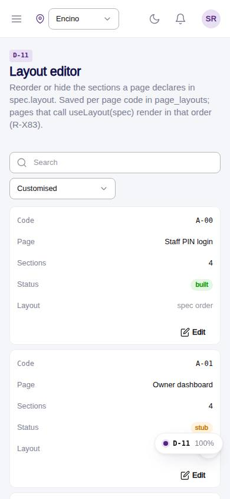
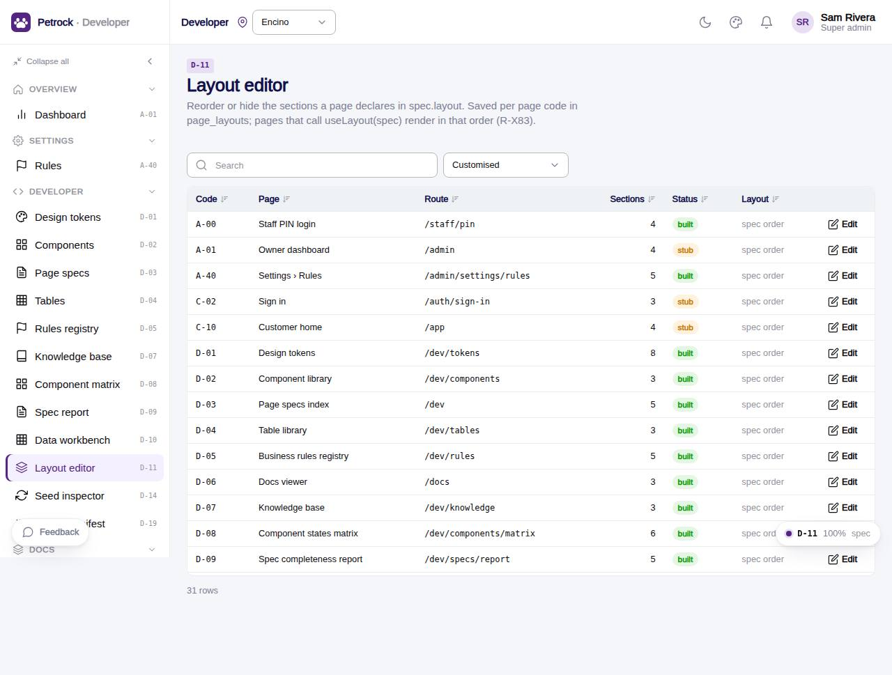

# D-11 · Layout editor

## Purpose

A super admin tailoring a page reorders and hides the sections it declares in spec.layout, per page code. The result is saved to page_layouts; pages that call useLayout(spec) (src/layout/useLayout.ts) render in that order and the spec keeps the section names (R-X83). Reset returns to the spec order.

## Screenshots

| 390 | 1280 |
| --- | --- |
|  |  |

Dark: not captured (not a key page); the theme toggle in the top bar switches it live.

## Sections (layout order)

1. Index: DataTable of pages (code, route, sections, status, customised badge) with a Customised filter
2. PageHeader: page picker, Reset to spec, Save; customised / unsaved badges; open page link
3. Sections: LayoutSectionList (drag, arrows, show / hide toggle)
4. Preview: numbered outline as the page will render, hidden sections struck through
5. Adoption note with the useLayout snippet

## Data

| Table | Read / write | Notes |
| --- | --- | --- |
| `page_layouts` | read/write | one row per page_code: order[], hidden[] |

## Rules

- R-X83 - layout edits persist per page code

## Logic

- applyLayout(spec, row): saved order first, new spec sections appended, hidden filtered to existing names
- Save updates the row or inserts one; Reset deletes it; dirty = items differ from the saved state

## Components

PageHeader, LayoutSectionList, Card, Section, Button, Select, Badge, DataTable, EmptyState, Toast

## Real vs mock

Real against the mock provider. Only pages that adopt useLayout react to a saved layout; the foundation pages do not yet (see gaps).

## Responsive check (D-016)

Checked at 360, 390, 768, 1280, 1920 in light and dark on 2026-09-18 with `npm run qa:responsive -- --codes=D-11` (no horizontal scroll, no console errors). The list drops the drag handle and moves the actions to a second line under 480 px.

## Changelog

- `docs/changelog/_pending/dev-quality.md` (to be merged into the next numbered entry)
