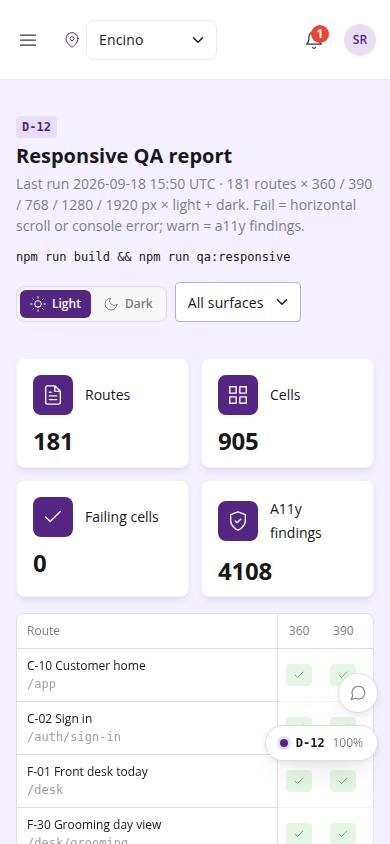
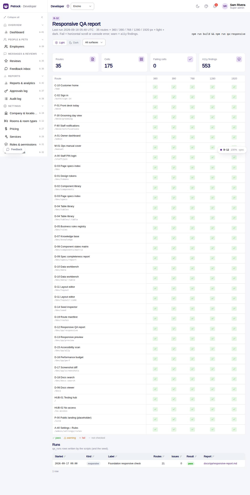

# D-12 · Responsive QA report

## Purpose

The integrator sees every route at 360 / 390 / 768 / 1280 / 1920 px in light and dark as scripts/qa-responsive.mjs last measured it: horizontal scroll, elements past the right edge, console errors and a11y findings per cell (D-016, R-X82). Clicking a cell lists the offenders and jumps to the preview or the a11y scanner.

## Screenshots

| 390 | 1280 |
| --- | --- |
|  |  |

Dark: `../screenshots/D-12/390-dark.jpg`, `../screenshots/D-12/1280-dark.jpg`.

## Sections (layout order)

1. PageHeader: last run, formula, how to run; theme toggle + surface filter
2. StatTiles: routes, cells, failing cells, a11y findings
3. QaMatrix routes x widths (click a cell)
4. Runs: qa_runs rows
5. Cell drawer: scroll width, console errors, offenders, a11y findings; Preview / Scan a11y buttons

## Data

| Table | Read / write | Notes |
| --- | --- | --- |
| `qa_runs` | read | runs written by scripts or the seed |
| `docs/qa/responsive-report.json` | read | bundled at build time |

## Rules

- R-X82 - every page at five widths, light and dark
- R-X87 - the same a11y checks run headless

## Logic

- fail = hscroll or console error; warn = a11y errors only; pass otherwise; missing cell = not checked
- Report bundled from docs/qa/responsive-report.json via import.meta.glob

## Components

PageHeader, StatTile, QaMatrix, SegmentedControl, Select, Drawer, Badge, DataTable, EmptyState, Button

## Real vs mock

The report is a build artefact: run npm run build then npm run qa:responsive and rebuild to bundle the new numbers. qa_runs rows from scripts are not yet written automatically (seeded row only).

## Responsive check (D-016)

Checked at 360, 390, 768, 1280, 1920 in light and dark on 2026-09-18 with `npm run qa:responsive -- --codes=D-12` (no horizontal scroll, no console errors). Matrix scrolls horizontally with a sticky route column on phones.

## Changelog

- `docs/changelog/_pending/dev-quality.md` (to be merged into the next numbered entry)
- 0019 - QA fixes: Reads the full responsive matrix (every route, 5 widths, 2 themes) produced by the reworked `qa-responsive.mjs`.
