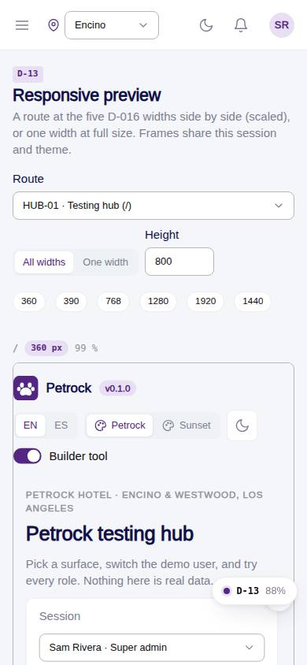
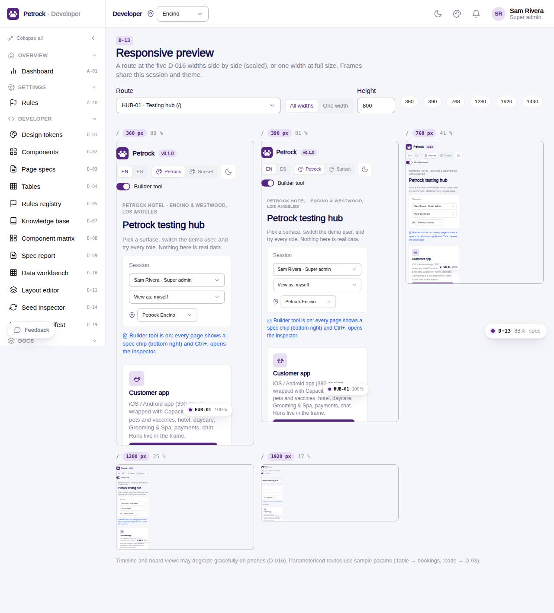

# D-13 · Responsive preview

## Purpose

A builder checks any route at all five D-016 widths side by side (scaled to fit) or at one width full size, without resizing the browser. Frames are same-origin iframes of this build and share the session and theme.

## Screenshots

| 390 | 1280 |
| --- | --- |
|  |  |

Dark: not captured (not a key page); the theme toggle in the top bar switches it live.

## Sections (layout order)

1. PageHeader: route picker, All widths / One width, width and height inputs, width chips (360 390 768 1280 1920 1440)
2. Frame grid: one ViewportFrame per width
3. Single frame at full size (scrolls horizontally when wider than the page)
4. Footnote on graceful degradation

## Data

| Table | Read / write | Notes |
| --- | --- | --- |
| `(none)` | read | routes from the registry |

## Rules

- R-X82 - visual check at the five widths

## Logic

- Frames load ./#<route>; parameterised routes use sample params (:table -> bookings, :code -> D-03)
- ResizeObserver scales the frame to its column; scale % is shown

## Components

PageHeader, ViewportFrame, Select, Chip, SegmentedControl, Input, Card

## Real vs mock

All real.

## Responsive check (D-016)

Checked at 360, 390, 768, 1280, 1920 in light and dark on 2026-09-18 with `npm run qa:responsive -- --codes=D-13` (no horizontal scroll, no console errors). On phones the grid collapses to one column; every frame is still scaled to the column width.

## Changelog

- `docs/changelog/_pending/dev-quality.md` (to be merged into the next numbered entry)
