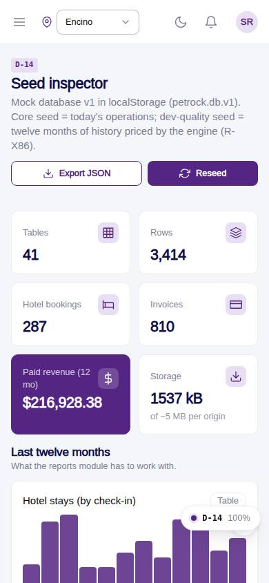
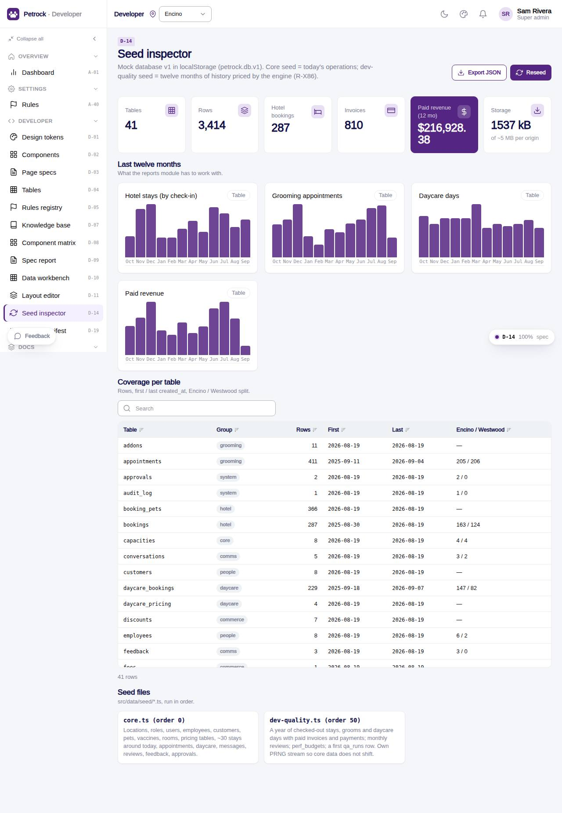

# D-14 · Seed inspector

## Purpose

A super admin (or the reports builder) sees what the mock database holds: rows per table, twelve months of stays, grooms, daycare days and paid revenue by month, first / last dates and location split per table, localStorage size, seed version; can reseed and export the whole database as JSON. Proves R-X86 (a year of history for reports).

## Screenshots

| 390 | 1280 |
| --- | --- |
|  |  |

Dark: `../screenshots/D-14/390-dark.jpg`, `../screenshots/D-14/1280-dark.jpg`.

## Sections (layout order)

1. PageHeader: Export JSON, Reseed
2. StatTiles: tables, rows, hotel bookings, invoices, paid revenue (12 mo), storage
3. Last twelve months: MiniBarChart x4 (stays, grooming, daycare, revenue)
4. Coverage per table (DataTable)
5. Seed files (core.ts order 0, dev-quality.ts order 50)

## Data

| Table | Read / write | Notes |
| --- | --- | --- |
| `bookings, appointments, daycare_bookings, invoices, payments` | read | monthly counts and revenue |
| `every table` | read | coverage |

## Rules

- R-X86 - demo data covers a full year

## Logic

- Months from check_in / starts_at / date over the last 12 calendar months; revenue = paid invoices.total by issued_at month
- Storage = length of localStorage petrock.db.v1 / 1024

## Components

PageHeader, StatTile, MiniBarChart, DataTable, Card, Section, Button, Badge, Toast

## Real vs mock

Mock only by nature; with Company-OS the page would read counts from the API instead of peek().

## Responsive check (D-016)

Checked at 360, 390, 768, 1280, 1920 in light and dark on 2026-09-18 with `npm run qa:responsive -- --codes=D-14` (no horizontal scroll, no console errors). Charts reflow to one column on phones; sparse x labels keep months readable.

## Changelog

- `docs/changelog/_pending/dev-quality.md` (to be merged into the next numbered entry)
