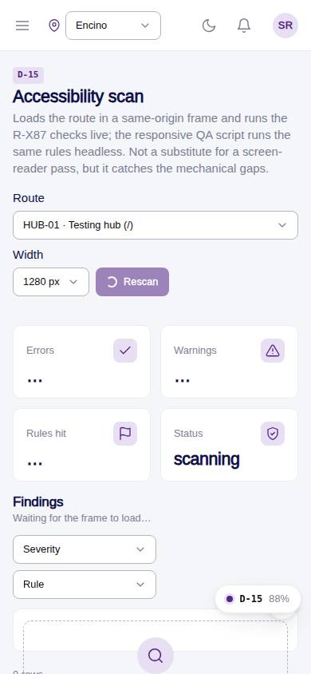
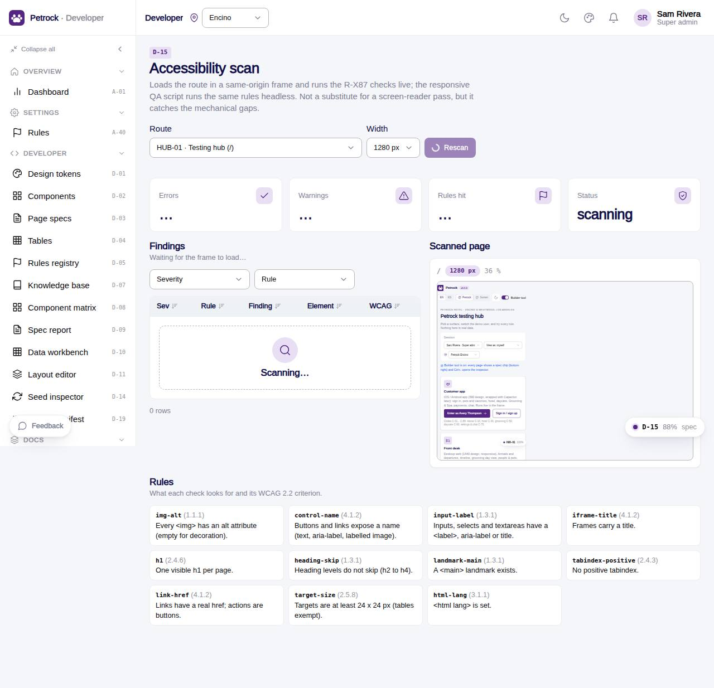

# D-15 · Accessibility scan

## Purpose

A builder loads any route in a same-origin frame and gets the R-X87 findings live: images without alt, controls without a name, unlabelled inputs, untitled iframes, heading order, missing main landmark, positive tabindex, tiny targets, missing html lang; each with selector and WCAG 2.2 criterion. The responsive QA script runs the identical checks headless.

## Screenshots

| 390 | 1280 |
| --- | --- |
|  |  |

Dark: not captured (not a key page); the theme toggle in the top bar switches it live.

## Sections (layout order)

1. PageHeader: route picker, width, Rescan
2. StatTiles: errors, warnings, rules hit, status
3. Findings (DataTable with severity / rule filters)
4. Scanned page (ViewportFrame)
5. Rules legend with WCAG criteria

## Data

| Table | Read / write | Notes |
| --- | --- | --- |
| `(none)` | read | routes from the registry |

## Rules

- R-X87 - accessible names, alt text, labels, landmarks

## Logic

- scanA11y(iframe.contentDocument) 500 ms after load; findings capped at 200
- Exemptions: visually-hidden native inputs behind custom controls, checkbox / radio / range / file inputs, inline text links, controls inside tables

## Components

PageHeader, StatTile, DataTable, ViewportFrame, Select, Badge, Button, Card, Section

## Real vs mock

All real; not a substitute for a screen-reader pass.

## Responsive check (D-016)

Checked at 360, 390, 768, 1280, 1920 in light and dark on 2026-09-18 with `npm run qa:responsive -- --codes=D-15` (no horizontal scroll, no console errors). Two-column layout stacks under 900 px.

## Changelog

- `docs/changelog/_pending/dev-quality.md` (to be merged into the next numbered entry)
