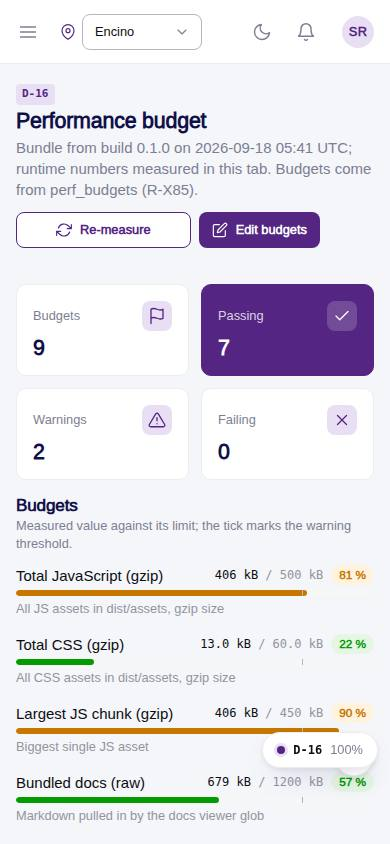
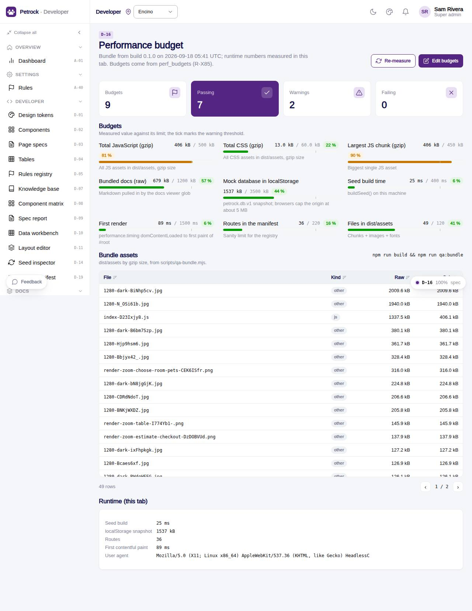

# D-16 · Performance budget

## Purpose

The integrator compares the last build (scripts/qa-bundle.mjs -> docs/qa/bundle-report.json: JS / CSS gzip totals, largest chunk, file count, bundled docs) and runtime numbers measured in this tab (seed build time, localStorage size, route count, first contentful paint) against the perf_budgets table. Budgets are rows, never constants (R-X85).

## Screenshots

| 390 | 1280 |
| --- | --- |
|  |  |

Dark: not captured (not a key page); the theme toggle in the top bar switches it live.

## Sections (layout order)

1. PageHeader: build version + date, Re-measure, Edit budgets (opens perf_budgets in the workbench)
2. StatTiles: budgets, passing, warnings, failing
3. Budgets: BudgetBar per active row
4. Bundle assets (DataTable by gzip size)
5. Runtime (this tab)

## Data

| Table | Read / write | Notes |
| --- | --- | --- |
| `perf_budgets` | read | metric, budget, unit, warn_at_percent |
| `docs/qa/bundle-report.json` | read | bundled at build time |

## Rules

- R-X85 - limits live in perf_budgets

## Logic

- bundle metrics: js_total_kb, css_total_kb, largest_chunk_kb, assets_count_max, docs_kb
- runtime: seed_ms from buildSeed(), localstorage_kb, route_count_max, first_render_ms from the paint entry
- status fail > 100 %, warn >= warn_at_percent

## Components

PageHeader, BudgetBar, DataTable, StatTile, Card, Section, Button, Badge, EmptyState

## Real vs mock

Bundle numbers are a build artefact (rebuild after npm run qa:bundle to bundle them). Runtime numbers are real for this tab.

## Responsive check (D-016)

Checked at 360, 390, 768, 1280, 1920 in light and dark on 2026-09-18 with `npm run qa:responsive -- --codes=D-16` (no horizontal scroll, no console errors). Budget grid collapses to one column under 640 px.

## Changelog

- `docs/changelog/_pending/dev-quality.md` (to be merged into the next numbered entry)
