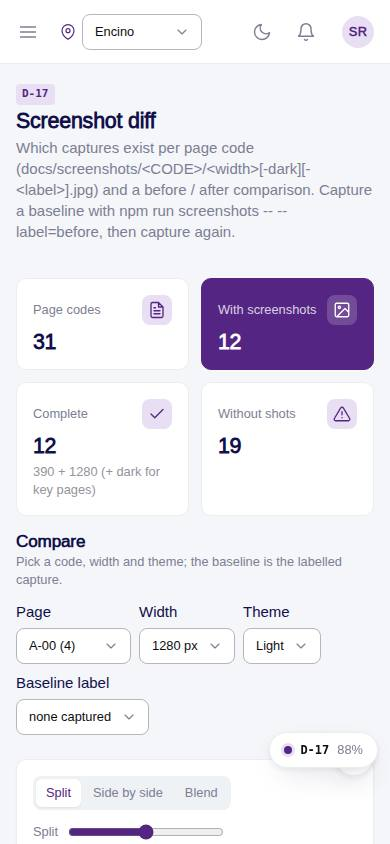
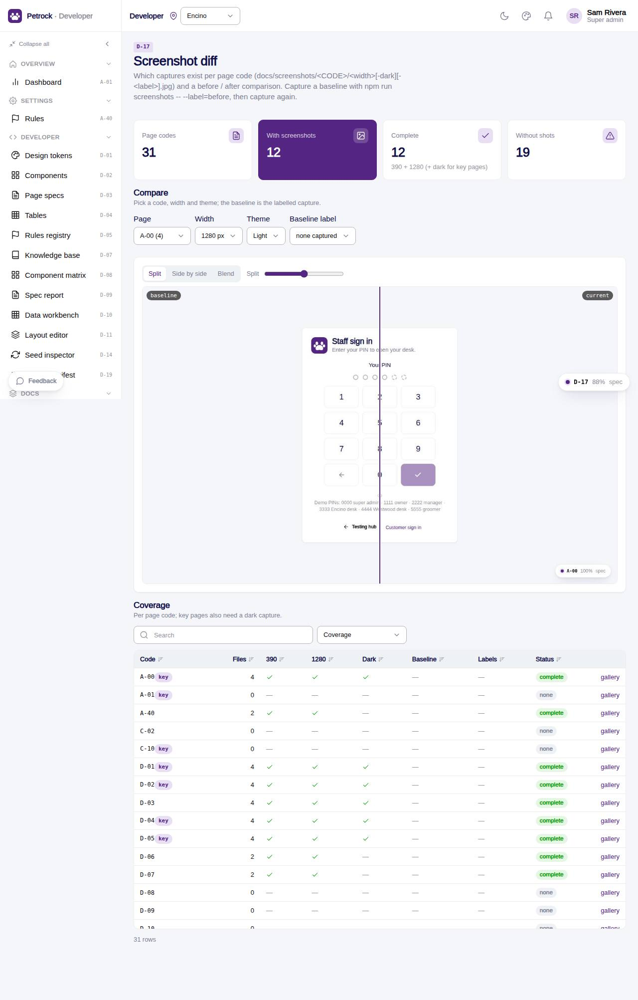

# D-17 · Screenshot diff

## Purpose

The integrator sees which screenshots exist per page code (390, 1280, dark, labelled baselines), which codes have none, and compares a baseline capture (npm run screenshots -- --label=before) with the current one as a split, side by side or blend.

## Screenshots

| 390 | 1280 |
| --- | --- |
|  |  |

Dark: not captured (not a key page); the theme toggle in the top bar switches it live.

## Sections (layout order)

1. PageHeader with the capture recipe
2. StatTiles: page codes, with screenshots, complete, without shots
3. Compare: page / width / theme / baseline label pickers + ImageCompare
4. Coverage (DataTable; key pages need dark)

## Data

| Table | Read / write | Notes |
| --- | --- | --- |
| `docs/screenshots/**` | read | bundled images, file name <width>[-dark][-<label>].jpg |

## Rules

- R-X82 - screenshots at 390 and 1280 are part of the definition of done

## Logic

- screenshotIndex() parses width / dark / label from file names
- complete = 390 + 1280 light (+ dark for KEY_PAGES)

## Components

PageHeader, StatTile, DataTable, ImageCompare, Select, Badge, Card, Section, EmptyState, Icon

## Real vs mock

Real; images are build assets.

## Responsive check (D-016)

Checked at 360, 390, 768, 1280, 1920 in light and dark on 2026-09-18 with `npm run qa:responsive -- --codes=D-17` (no horizontal scroll, no console errors). Side-by-side mode stacks under 600 px.

## Changelog

- `docs/changelog/_pending/dev-quality.md` (to be merged into the next numbered entry)
