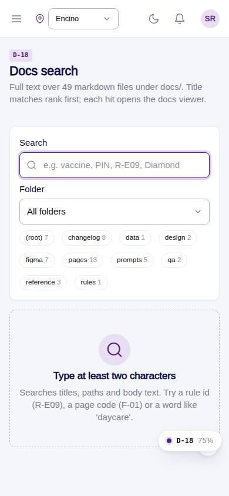
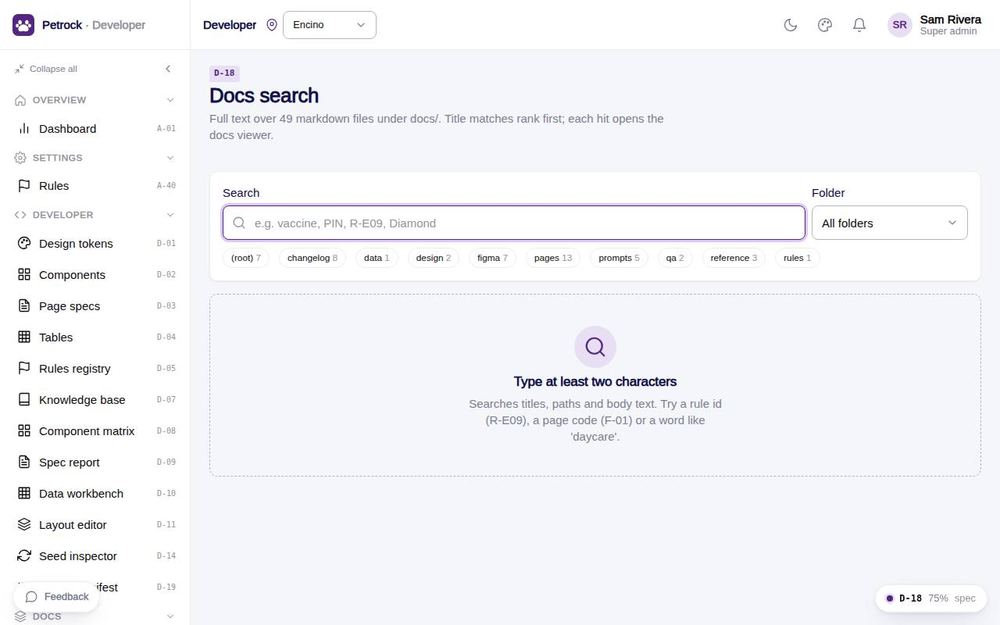

# D-18 · Docs search

## Purpose

Anyone with docs access (super admin, owner, manager) searches every markdown file under docs/ by title, path and body, filters by folder, and opens the hit in the docs viewer (D-06). The docs sidebar filter links here with the current query.

## Screenshots

| 390 | 1280 |
| --- | --- |
|  |  |

Dark: not captured (not a key page); the theme toggle in the top bar switches it live.

## Sections (layout order)

1. PageHeader
2. Search card: query input, folder select, folder chips with counts
3. Results card: count line + SearchHitList with highlighted snippets
4. Empty state with example queries

## Data

| Table | Read / write | Notes |
| --- | --- | --- |
| `(none)` | read | docs from src/modules/docs/docsIndex.ts (bundled markdown) |

## Rules

- none (tooling page)

## Logic

- searchDocs(): every term must match title or body; score = title x20 + path x5 + min(matches, 30); snippet around the first match
- Query and folder live in the hash query string (?q=&folder=) so results are linkable

## Components

PageHeader, Input, Select, SearchHitList, Chip, Card, EmptyState

## Real vs mock

All real, client-side over the bundled docs.

## Responsive check (D-016)

Checked at 360, 390, 768, 1280, 1920 in light and dark on 2026-09-18 with `npm run qa:responsive -- --codes=D-18` (no horizontal scroll, no console errors). Search bar stacks under 600 px.

## Changelog

- `docs/changelog/_pending/dev-quality.md` (to be merged into the next numbered entry)
