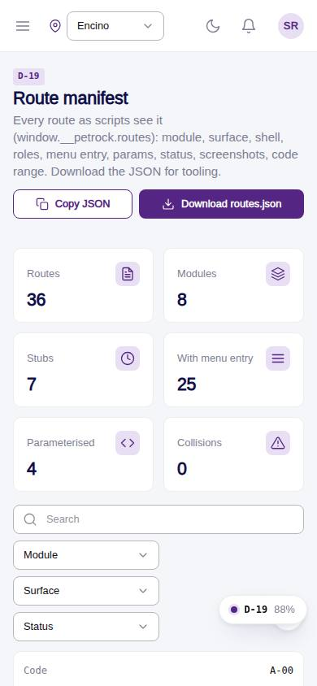
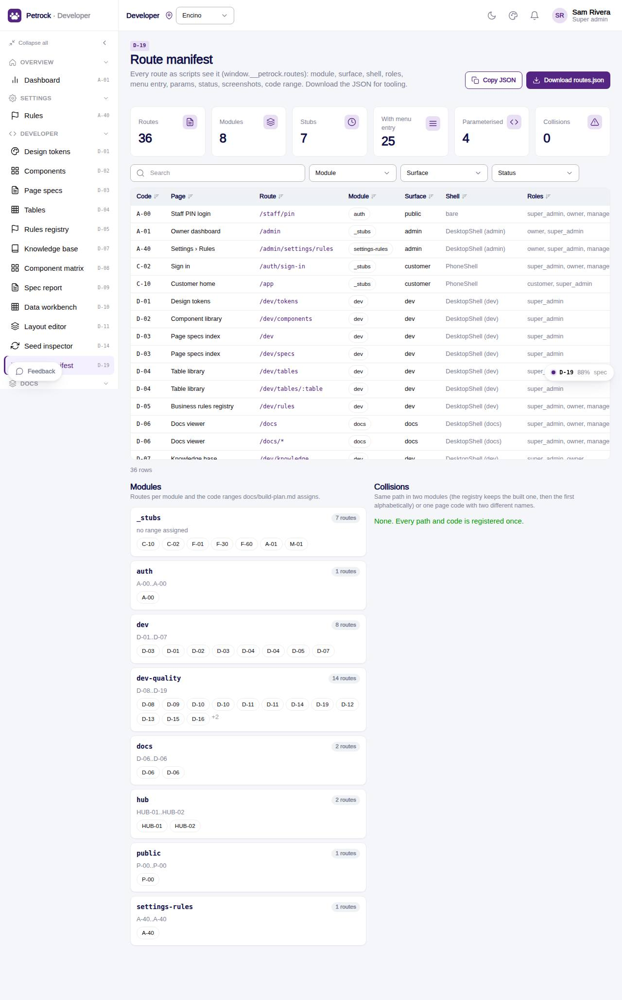

# D-19 · Route manifest

## Purpose

Tooling authors and the integrator see the registry as scripts see it: every route with module, surface, shell, roles, menu entry, params, built / stub, screenshot count and code-range check; routes per module; collisions (same path in two modules or one code with two names). The manifest downloads as routes.json for scripts/screenshots.mjs and qa-responsive.mjs.

## Screenshots

| 390 | 1280 |
| --- | --- |
|  |  |

Dark: not captured (not a key page); the theme toggle in the top bar switches it live.

## Sections (layout order)

1. PageHeader: Copy JSON, Download routes.json
2. StatTiles: routes, modules, stubs, with menu entry, parameterised, collisions
3. DataTable with module / surface / status filters
4. Modules: routes per module with assigned code ranges
5. Collisions

## Data

| Table | Read / write | Notes |
| --- | --- | --- |
| `(none)` | read | buildManifest(getRoutes()) + getModules() |

## Rules

- R-X80 - no route without a spec; codes inside their module range

## Logic

- range badge when a code sits in another module's range (CODE_RANGES from docs/build-plan.md)
- collision detection walks every module's routes, not just the registry winners

## Components

PageHeader, StatTile, DataTable, Badge, Button, Chip, Card, Section, Toast

## Real vs mock

All real.

## Responsive check (D-016)

Checked at 360, 390, 768, 1280, 1920 in light and dark on 2026-09-18 with `npm run qa:responsive -- --codes=D-19` (no horizontal scroll, no console errors). Wide table becomes cards under 768 px.

## Changelog

- `docs/changelog/_pending/dev-quality.md` (to be merged into the next numbered entry)
