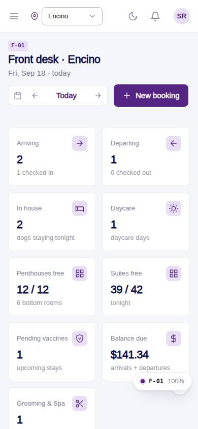
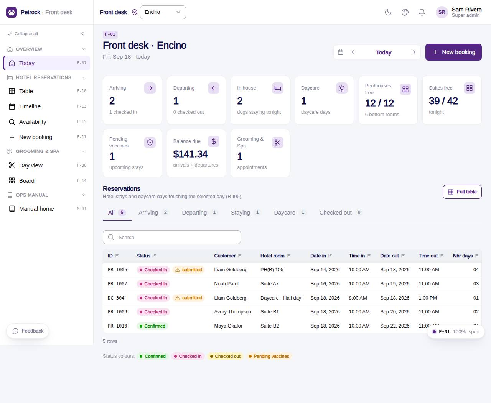

# F-01 · Front desk today

## Purpose

The desk's home for one location and one day. Marcus (front desk, Encino) opens it in the morning and sees how many dogs arrive, leave and stay, how many rooms are free tonight, which stays are blocked by vaccines or have no room, and what is owed at check-out. The reservations of the day sit below with one-click Check in / Check out; anything that needs a manager (cancel, no-show, confirming without vaccines) opens the PIN approval modal.

## Screenshots

| 390 | 1280 |
| --- | --- |
|  |  |

Dark: `../screenshots/F-01/390-dark.jpg`, `../screenshots/F-01/1280-dark.jpg`.

## Sections (layout order)

1. PageHeader - location, selected day, `ReservationDayNav` (Today / arrows / picker), New booking
2. StatTiles - Arriving, Departing, In house, Daycare, rooms free per room type tonight, Pending vaccines, Balance due, Grooming & Spa appointments (each tile filters the table or links to the view)
3. Needs attention - vaccine issues on arriving / staying dogs, arrivals without a room, balances due on departures
4. Day tabs - All / Arriving / Departing / Staying / Daycare / Checked out with counts (R-I05)
5. Reservations table - dense `DataTable` (11 columns of the 18), quick action per row (Check in / Check out / Confirm) and Open
6. `RoomPickModal` when checking in a stay that has no room; `PinApprovalModal` for gated transitions

## Data

| Table | Read / write | Notes |
| --- | --- | --- |
| `bookings` | read / write | status, room_id on check-in |
| `booking_pets`, `pets`, `customers` | read | joined into reservation rows |
| `daycare_bookings` | read | Daycare group |
| `appointments` | read | Grooming tile |
| `rooms`, `room_types` | read | rooms free tonight (R-X03) |
| `vaccine_records`, `vaccine_types` | read | per-pet vaccine summary |
| `booking_events`, `audit_log`, `approvals` | write | every status change |

## Rules

- `R-I05` - day buckets via `bucketOf()` / `dayBucket()`; daycare days are their own group
- `R-I06` - `transitionNeedsPin()` decides whether the PIN modal opens
- `R-I01`, `R-I02` - one status vocabulary and colour set (`StatusBadge`)
- `R-X03` - rooms free tonight = `availabilityByType(day, day+1)`
- `R-X05` - check-in without a room opens the room picker first
- `R-K01`, `R-E11`, `R-E12` - location pinned in the TopBar, capacities from `rooms`
- `R-A05` - pending-vaccine stays are surfaced in Needs attention

## Logic

- Quick action = the natural next transition of the current status (`QUICK` map); locked icon when PIN-gated.
- Balance due = sum of `total - deposit` of arriving and departing stays.
- Attention items are capped at 9; each opens the booking detail.

## Components

PageHeader, ReservationDayNav, StatTile, Section, Tabs, DataTable, StatusBadge, PetVaccineStatus, Button, IconButton, Icon, EmptyState, RoomAssignmentPicker (via RoomPickModal), Modal, PinApprovalModal.

## Real vs mock

All data is the mock provider (localStorage). PIN check is the mock hash. When Company-OS lands, `useTable` reads the same tables through `CompanyOsProvider`; nothing on the page changes.

## Responsive check (D-016)

Checked at 360, 390, 768, 1280, 1920 on 2026-09-18 (Playwright, `scratchpad/qa.mjs`): no horizontal scroll, no console errors. Stat tiles reflow to 2 columns on phones; the table becomes cards under 768 px; the sidebar is an overlay drawer under 900 px.

## Changelog

- `docs/changelog/_pending/frontdesk-reservations.md`
