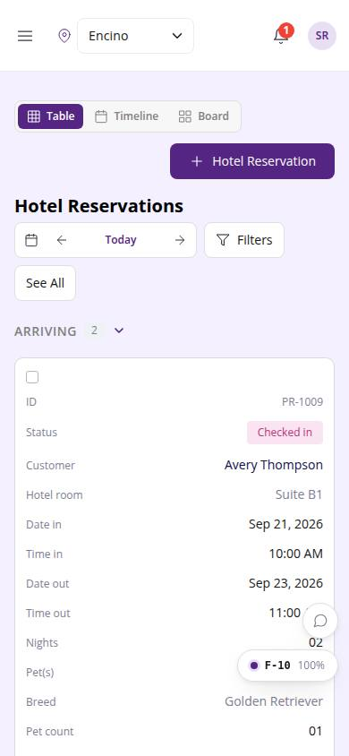
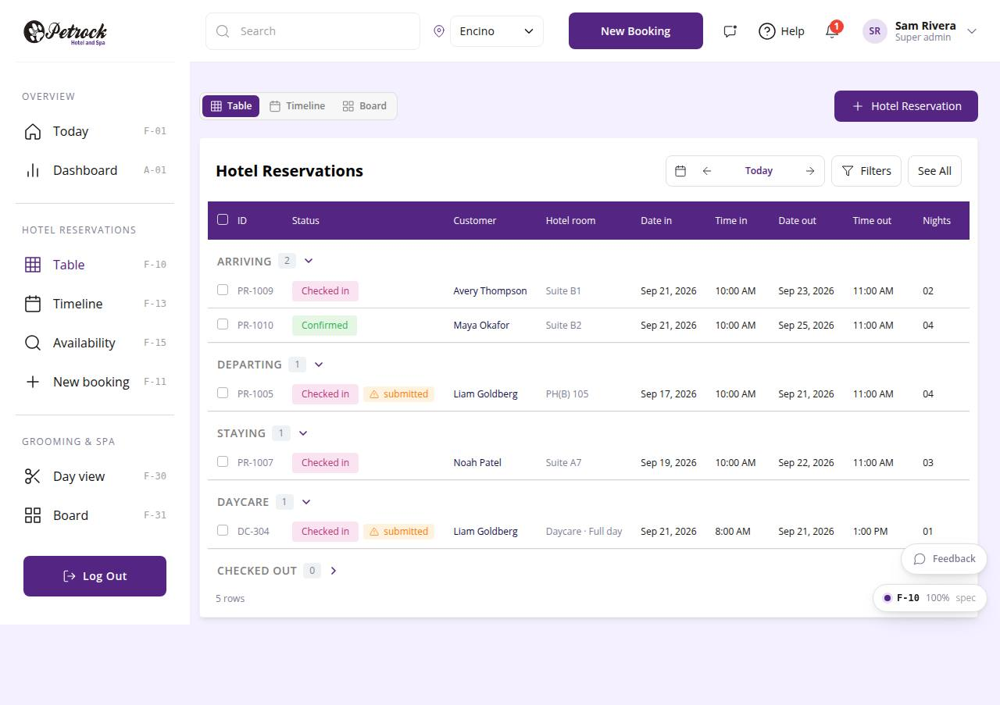

# F-10 · Hotel & Daycare reservations (table)

## Purpose

The reservations table of the Figma v2 design (`front desk.jpg`): "+ Hotel Reservation" top-right, then one white container holding the "Hotel Reservations" title, the day navigator, a **Filters** popover (status, hotel vs daycare, room type, search, cancelled toggle) and **See All** (all upcoming) / **By day**; ONE purple 49 px head with head / row checkboxes, and the Arriving / Departing / Staying / Daycare / Checked out **group rows inside the same table** (R-I05), 18 columns with the Figma cell tones, 44 px rows, mint / tinted status badges. The Table / Timeline / Board switch implements D-008.

## Screenshots

| 390 | 1280 |
| --- | --- |
|  |  |

Dark: `../screenshots/F-10/390-dark.jpg`, `../screenshots/F-10/1280-dark.jpg`.

Before the 2026-09-21 look-and-feel pass (prompt 0018): `../screenshots/F-10/390-before.jpg`, `../screenshots/F-10/1280-before.jpg` - the D-17 screenshot diff at `/#/dev/qa/screenshots` shows before and after side by side.

## Sections (layout order)

1. TopLine (view switch, + Hotel Reservation)
2. ReservationsTable (framed DataTable: title, day navigator, Filters popover, See All / By day; one purple head; Arriving / Departing / Staying / Daycare / Checked out section rows with a count Badge; head + row checkboxes)
3. DaycareDrawer

## Data

| Table | Read / write | Notes |
| --- | --- | --- |
| `bookings`, `booking_pets`, `daycare_bookings` | read | joined by `useReservationRows()` |
| `customers`, `pets`, `rooms`, `room_types` | read | names, breeds, room codes |
| `vaccine_records`, `vaccine_types` | read | vaccine flag next to the status |

## Rules

- `R-I05` - Arriving / Departing / Staying / Checked out groups (plus Daycare)
- `R-I02`, `R-I01` - design chips Future / Checking In / Checked Out map to the lifecycle
- `R-D14`, `R-H08` - Balance = Total charge - Deposits
- `R-I08` - page-level "+ Hotel reservation" entry point
- `R-K01` - rows scoped to the current location

## Logic

- 18 design columns: ID, Status, Customer, Hotel room, Date in, Time in, Date out, Time out, Nbr days, Pet(s), Breed, Pet count, Mobile, Home, Total charge, Deposits, Balance, Booking notes.
- Balance = total - deposits (R-D14).
- Nbr days = nights for hotel, 1 for daycare.
- Cancelled and no-show rows hidden unless the toggle is on.
- Times, counts, phones and money use the DataTable `num` tone (tabular numerals in body colour) instead of Figma's purple, so only real links read as links; the purple head stays (D-216).

## Components

`SegmentedControl`, `ReservationDayNav`, `FilterPopover`, `Select`, `Input`, `Toggle`, `DataTable`, `Checkbox`, `StatusBadge`, `PetVaccineStatus`, `Drawer`, `BookingInfoGrid`, `Button`, `IconButton`, `EmptyState`.

## Actions (D-196, D-197)

Declared in the page spec; this is what a voice / agent controller and the future WebMCP tools drive. Every UI change on this page updates the list in the same commit.

| id | Label | Intent | Permission | Params |
| --- | --- | --- | --- | --- |
| `reservations.switchView` | Switch view | show the reservations as a table, timeline or board | - | `view: enum:table,timeline,board` |
| `reservations.newBooking` | New hotel reservation | start a new hotel reservation | `bookings.write` | - |
| `reservations.setDay` | Change the day | show the reservations of another day | - | `day: date` |
| `reservations.seeAll` | See all upcoming | switch between the selected day and all upcoming reservations | - | - |
| `reservations.filter` | Filter the table | filter reservations by search text, status, kind or room type | - | `q: string, status: string, kind: enum:hotel,daycare, roomType: id, showClosed: string` |
| `reservations.toggleGroup` | Collapse a section | collapse or expand the arriving, departing, staying, daycare or checked-out section | - | `group: enum:arriving,departing,staying,daycare,checked_out` |
| `reservations.openBooking` | Open a reservation | open one reservation | - | `id: id` |
| `reservations.editBooking` | Edit a reservation | edit one hotel reservation | `bookings.write` | `id: id` |

## Real vs mock

Mock provider. Open question 69 (what distinguishes DEPARTING from "Checking out") resolved by using the lifecycle buckets; see `docs/decisions/_pending/frontdesk-reservations.md`.

## Responsive check (D-016)

Checked at 360, 390, 768, 1280, 1920, 2560 and 3840, light and dark (2026-09-21, D-194): the table scrolls horizontally inside its frame with the purple head sticky; section rows keep their count badge at every width; the phone card layout hides the `hideOnCard` columns. Numbers use tabular numerals so columns line up at 4K.

## Changelog

- `docs/changelog/_pending/frontdesk-reservations.md`
- 0032 - look-and-feel pass: one `ScheduleCard` and one `AppointmentBoard` (D-231, D-234), calm timeline grid (D-232), muted groomer hues with lanes (D-233), desk-table `num` tone and section rows (D-235); spec `actions` added, `checkedAt` to 3840.
